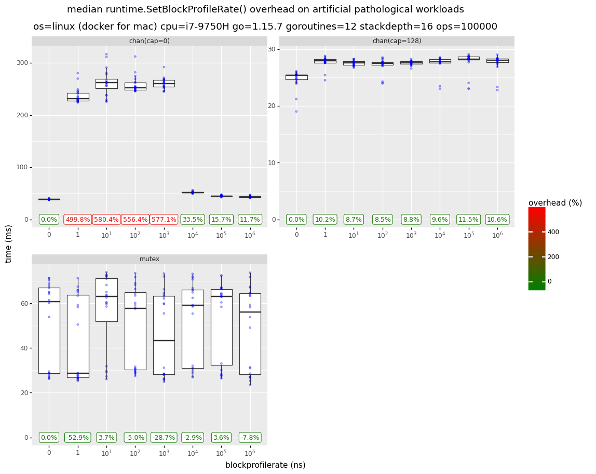
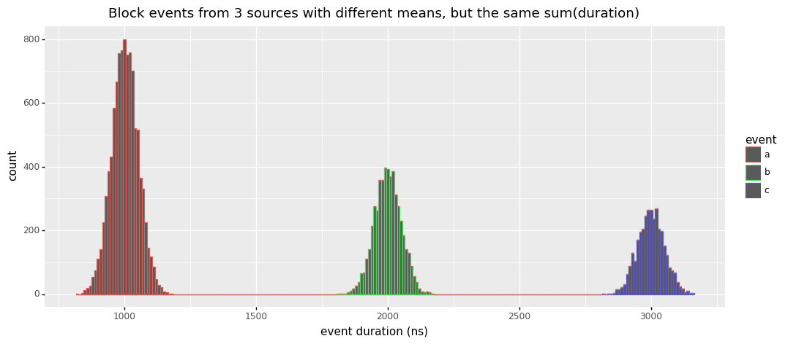
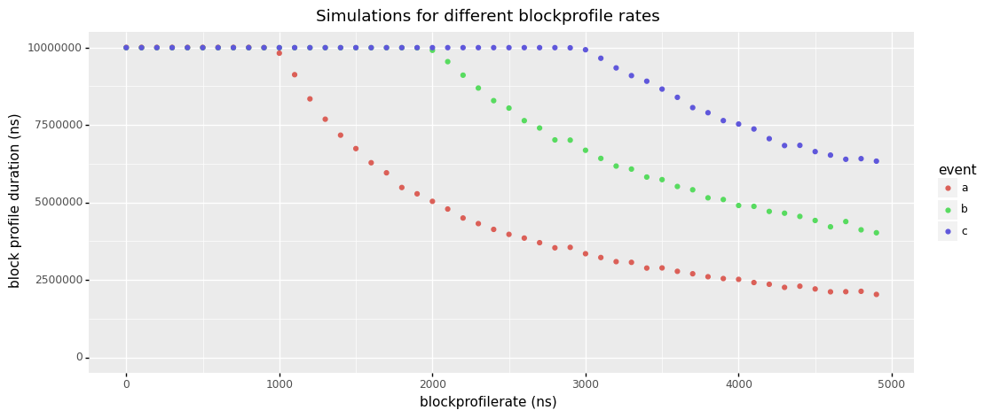
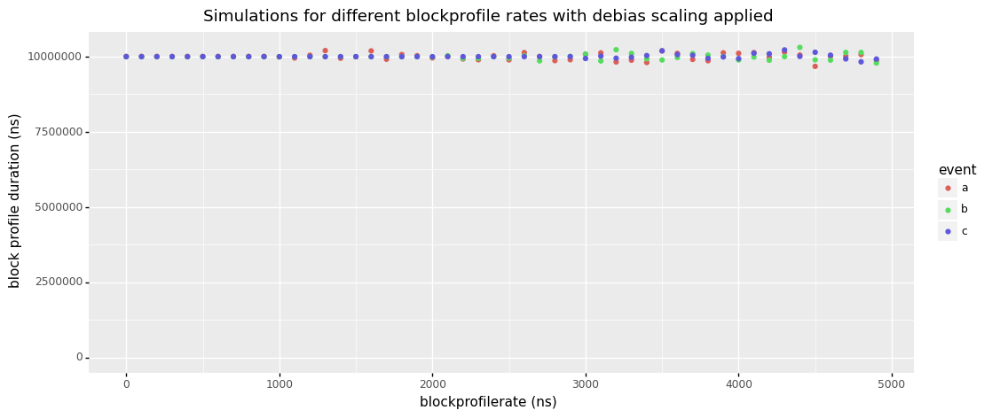

This document was last updated for `go1.15.7` but probably still applies to older/newer versions for the most parts.

# Block Profiling in Go

<!-- https://ecotrust-canada.github.io/markdown-toc/ -->

* [Description](#description)
* [Usage](#usage)
* [Overhead](#overhead)
  + [Implementation Details](#implementation-details)
  + [Benchmarks](#benchmarks)
  + [Memory Usage](#memory-usage)
  + [Initialization Time](#initialization-time)
* [Accuracy](#accuracy)
  + [Sampling Bias](#sampling-bias)
    - [Simple Example](#simple-example)
    - [Simulation & Proposal for Improvement](#simulation---proposal-for-improvement)
  + [Time Stamp Counter](#time-stamp-counter)
  + [Stack Depth](#stack-depth)
  + [Spin Locks](#spin-locks)
* [Relationship with Wall Clock Time](#relationship-with-wall-clock-time)
* [Relationship with Mutex Profiling](#relationship-with-mutex-profiling)
* [Profiler Labels](#profiler-labels)
* [pprof Output](#pprof-output)
* [History](#history)
* [Disclaimers](#disclaimers)

## Description

The block profile in Go lets you analyze how much time your program spends waiting on the blocking operations listed below:

- [select](https://github.com/golang/go/blob/go1.15.7/src/runtime/select.go#L511)
- [chan send](https://github.com/golang/go/blob/go1.15.7/src/runtime/chan.go#L279)
- [chan receive](https://github.com/golang/go/blob/go1.15.7/src/runtime/chan.go#L586)
- [semacquire](https://github.com/golang/go/blob/go1.15.7/src/runtime/sema.go#L150) ( [`Mutex.Lock`](https://golang.org/pkg/sync/#Mutex.Lock), [`RWMutex.RLock`](https://golang.org/pkg/sync/#RWMutex.RLock) , [`RWMutex.Lock`](https://golang.org/pkg/sync/#RWMutex.Lock), [`WaitGroup.Wait`](https://golang.org/pkg/sync/#WaitGroup.Wait))
- [notifyListWait](https://github.com/golang/go/blob/go1.15.7/src/runtime/sema.go#L515) ( [`Cond.Wait`](https://golang.org/pkg/sync/#Cond.Wait))

Time is only tracked when Go has to suspend the goroutine's execution by parking it into a [waiting](https://github.com/golang/go/blob/go1.15.7/src/runtime/runtime2.go#L51-L59) state. So for example a `Mutex.Lock()` operation will not show up in your profile if the lock can be aquired immediately or via a short amount of [spinning](https://en.wikipedia.org/wiki/Spinlock).

The operations above are a subset of the [waiting states](https://github.com/golang/go/blob/go1.15.7/src/runtime/runtime2.go#L996-L1024) used by the Go runtime, i.e. the operations below **will not** show up in a block profile:

- [`time.Sleep`](https://golang.org/pkg/time/#Sleep) (but [`time.After`](https://golang.org/pkg/time/#After), [`time.Tick`](https://golang.org/pkg/time/#Tick) and other channel based wrappers will show up)
- GC
- Syscalls
- Internal Locks (e.g. for [stopTheWorld](https://github.com/golang/go/blob/go1.15.7/src/runtime/proc.go#L900))
- Blocking in [cgo](https://golang.org/cmd/cgo/) calls
- Events that block forever (e.g. sending/receiving on nil channels)

However, some of the waiting states above above can be analyzed using [Goroutine Profiling](./goroutine.md).

## Usage

The block profiler is disabled by default. You can enable it by passing a `rate > 0` as shown below.

```
runtime.SetBlockProfileRate(rate)
```

The `rate` impacts the [Accuracy](#accuracy) and [Overhead](#overhead) of the profiler. In the [docs](https://golang.org/pkg/runtime/#SetBlockProfileRate) the rate is described like this:

> SetBlockProfileRate controls the fraction of goroutine blocking events that are reported in the blocking profile. The profiler aims to sample an average of one blocking event per rate nanoseconds spent blocked.
>
> To include every blocking event in the profile, pass rate = 1. To turn off profiling entirely, pass rate <= 0.

Personally I struggle to parse the second sentence, and prefer to describe the `rate` (aka `blockprofilerate`) like this instead:

- `rate <= 0` disables the profiler entirely (the default)
- `rate == 1` tracks every blocking event, regardless of the event `duration`.
- `rate => 2` sets the sampling rate in `nanoseconds`. Every event with a `duration >= rate` will be tracked. For events with a `duration < rate`, the profiler will [randomly](https://github.com/golang/go/blob/go1.15.7/src/runtime/mprof.go#L408) sample `duration / rate` events. E.g. if you have an event with a duration of `100ns` and your rate is `1000ns`, there is a `10%` chance it will be tracked by the block profiler.

Block durations are aggregated over the lifetime of the program (while the profiling is enabled). To get a [pprof formated](./pprof.md) snapshot of the current stack traces that lead to blocking events and their cumulative time duration, you can call:

```go
pprof.Lookup("block").WriteTo(myFile, 0)
```

Alternatively you can use [github.com/pkg/profile](https://pkg.go.dev/github.com/pkg/profile) for convenience, or [net/http/pprof](net/http/pprof) to expose profiling via http, or use a [continious profiler](https://www.datadoghq.com/product/code-profiling/) to collect the data automatically in production.

Last but not least you can use the [`runtime.BlockProfile`](https://golang.org/pkg/runtime/#BlockProfile) API to get the same information in a structured format.

## Overhead

**tl;dr:** A `blockprofilerate` >= `10000` (10µs) should have negligable impact on production apps, including those suffering from extreme contention.

### Implementation Details

Block profiling is essentially implemented like this inside of the Go runtime (see the links in the [Description](#description) above for real code):

```go
func chansend(...) {
  var t0 int64
  if blockprofilerate > 0 {
    t0 = cputicks()
  }
  // ... park goroutine in waiting state while blocked ...
  if blockprofilerate > 0 {
    cycles := cputicks() - t0
    if blocksampled(cycles) {
      saveblockevent(cycles)
    }
  }
}
```

This means that unless you enable block profiling, the overhead should be effectively zero thanks to CPU branch prediction.

When block profiling is enabled, every blocking operation will pay the overhead of two `cputicks()` calls. On `amd64` this is done via [optimized assembly](https://github.com/golang/go/blob/go1.15.7/src/runtime/asm_amd64.s#L874-L887) using the [RDTSC instruction](https://en.wikipedia.org/wiki/Time_Stamp_Counter) and takes a negligible `~10ns/op` on [my machine](https://github.com/felixge/dump/tree/master/cputicks). On other platforms various alternative clock sources are used which may have higher overheads and lower accuracy.

Depending on the configured `blockprofilerate` (more about this in the [Accuracy](#accuracy) section) the block event may end up getting saved. This means a stack trace is collected which takes `~1µs` on [my machine](https://github.com/felixge/dump/tree/master/go-callers-bench) (stackdepth=16). The stack is then used as a key to update an [internal hashmap](https://github.com/golang/go/blob/go1.15.7/src/runtime/mprof.go#L144) by incrementing the corresponding [`blockRecord`](https://github.com/golang/go/blob/go1.15.7/src/runtime/mprof.go#L133-L138) count and cycles.

```go
type blockRecord struct {
	count  int64
	cycles int64
}
```

The costs of updating the hash map is probably similar to collecting the stack traces, but I haven't measured it yet.

### Benchmarks

Anyway, what does all of this mean in terms of overhead for your application? It generally means that block profiling is **low overhead**. Unless your application spends literally all of its time parking and unparking goroutines due to contention, you probably won't be able to see a measurable impact even when sampling every block event.

That being said, the benchmark results below (see [Methodology](./bench/)) should give you an idea of the **theoretical worst case** overhead block profiling could have. The graph `chan(cap=0)` shows that setting `blockprofilerate` from  `1` to `1000` on a [workload](./bench/workload_chan.go) that consists entirely in sending tiny messages across unbuffered channels decreases throughput significantly. Using a buffered channel as in graph `chan(cap=128)` greatly reduces the problem to the point that it probably won't matter for real applications that don't spend all of their time on channel communication overheads.

It's also interesting to note that I was unable to see significant overheads for [`mutex`](.bench/workload_mutex.go) based workloads. I believe this is due to the fact that mutexes employe spin locks before parking a goroutine when there is contention. If somebody has a good idea for a workload that exhibits high non-spinning mutex contention in Go, please let me know!

Anyway, please remember that the graphs below show workloads that were specifically designed to trigger the worst block profiling overhead you can imagine. Real applications will usually see no significant overhead, especially when using a `blockprofilerate` >= `10000` (10µs).



### Memory Usage

Block profiling utilizes a shared hash map that [uses](https://github.com/golang/go/blob/go1.15.7/src/runtime/mprof.go#L207) `1.4 MiB` of memory even when empty. Unless you explicitly [disable heap profiling](https://twitter.com/felixge/status/1355846360562589696) in your application, this map will get allocated regardless of whether you use the block profiler or not.

Addtionally each unique stack trace will take up some additional memory. The `BuckHashSys` field of [`runtime.MemStats`](https://golang.org/pkg/runtime/#MemStats) allows you to inspect this usage at runtime. In the future I might try to provide additional information about this along with real world data.

### Initialization Time

The first call to `runtime.SetBlockProfileRate()` takes `100ms` because it tries to [measure](https://github.com/golang/go/blob/go1.15.7/src/runtime/runtime.go#L22-L47) the speed ratio between the wall clock and the [TSC](https://en.wikipedia.org/wiki/Time_Stamp_Counter) clock. However, recent changes around async preemption have [broken](https://github.com/golang/go/issues/40653#issuecomment-766340860) this code, so the call is taking only `~10ms` right now.

## Accuracy

### Sampling Bias

**tl;dr:** Setting your sampling `rate` too high will bias your results towards infrequent long events over frequent short events.

As described in the [Usage](#usage) section, the block profiler will sample as follows:

- Events with `duration >= rate` will be sampled 100%
- Events with `duration < rate` have a `duration / rate` chance of getting sampled.

The [implementation](https://github.com/golang/go/blob/go1.15.7/src/runtime/mprof.go#L408) for this looks like that:

```go
func blocksampled(cycles int64) bool {
	rate := int64(atomic.Load64(&blockprofilerate))
	if rate <= 0 || (rate > cycles && int64(fastrand())%rate > cycles) {
		return false
	}
	return true
}
```

This means that if you set your profiling `rate` low enough, you'll get very accurate results. However, if your `rate` is higher than the `duration` of some of the events you are sampling, the sampling process will exhibit a bias favoring infrequent events of higher `duration` over frequent events with lower `duration` even so they may contribute to the same amount of overall block duration in your program.

#### Simple Example

Let's say your `blockprofilerate` is `100ns` and your application produces the following events:

- `A`: `1` event with a duration of `100ns`.
- `B`: `10` events with a duration of `10ns` each.

Given this scenario, the `blockprofiler` is guaranteed to catch and accurately report event `A` as `100ns` in the profile. For event `B`  the most likely outcome is that the profiler will capture only a single event (10% of 10 events) and report `B` as `10ns` in the profile. So you might find yourself in a situation where you think event `A` is causing 10x more blocking than event `B`, which is not true.

#### Simulation & Proposal for Improvement

For an even better intuition about this, consider the [simulated example](./sim/block_sampling.ipynb) below. Here we have a histogram of all durations collected from 3 types of blocking events. As you can see, they all have different mean durations (`1000ns`, `2000ns`, `3000ns`) and they are occurring at different frequencies, with `count(a) > count(b) > count(c)`. What's more difficult to see, is that the cumulative durations of these events are the same, i.e. `sum(a) = sum(b) = sum(c)`, but you can trust me on that : ).



So given that your application might produce events like this, how will they show up in your block profile as you try out different `blockprofilerate` values? As you can see below, all is well and fine until a `blockprofilerate` of `1000ns`. Each event shows up with the same total duration in the profile (the red and green dots are hidden below the blue ones). However starting at `1000ns` you see that event `a` starts to fade from our profile and at `2000ns` you'd already think that events `b` and `c` are causing twice as much blocking time as event `a`.



So what can we do? Do we always need to live in fear of bias when working with block profiles? No! If the [Overhead](#overhead) for your workload allows it, the simplest solution is to use a low enough `blockprofilerate` in order to capture most blocking events.

But perhaps there is an even better way. I'm thinking we could correct for the current bias by keeping the same logic of sampling `duration / rate` fraction of events when `duration < rate`. However, when this happens we could simply multiply the sampled duration like this:

```
duration = duration * (rate/duration)
# note: the expression above can be simplified to just `duration = rate`
```

Doing so could be done with a trivial patch to the go runtime and the picture below shows the results from simulating it. So from my point of view it should be possible to eliminate this bias from future versions of Go and I'm planning to send a patch for it soon. That being said, I'm not trained in statistics, so my analysis here might be hilariously misguided.




🚧 It might be possible to reduce the bias in block profiles after recording them. I've got a [proof of concept](https://github.com/felixge/go-debias-blockprofile) for this, but it's not clear yet if this will work well in practice.

### Time Stamp Counter

`amd64` and other platforms use [TSC](https://en.wikipedia.org/wiki/Time_Stamp_Counter) for implementing the `cputicks()` function. This technique has been historically challenged by problems with frequency scaling and other kinds of CPU power transitions. Modern CPUs should provide invariant TSCs, but at [least some Go users](https://github.com/golang/go/issues/16755#issuecomment-332279965) are still reporting issues. I can't tell whether those are due to broken hardware or issues regarding multi-socket systems, but hope to do more research on this in the future.

Please also note the bug description in the [Initialization Time](#initialization-time) section which may impact the accuracy of converting cputicks to wall clock time.

### Stack Depth

The max stack depth for block profiles is [32](https://github.com/golang/go/blob/go1.15.7/src/runtime/mprof.go#L31). Block events occurring at deeper stack depths will still be included in the profile, but the resulting data might be more difficult to work with.

### Spin Locks

As described earlier, contended Go mutexes will first try to [spin](https://en.wikipedia.org/wiki/Spinlock) for a bit before yielding to the scheduler. If the spinning is successful, no block event will be tracked. This presents another subtle bias in the block profiler towards events of longer duration.

🚧 This section needs more research that I'll do as part of my mutex profiler note.

## Relationship with Wall Clock Time

Blocking time is not bound by wall clock time. Multiple goroutines can simultaneously spend time blocking, which means it's possible to see profiles with a cumulative block duration that exceeds the runtime of the program.

## Relationship with Mutex Profiling

The [mutex](./mutex.md) profiling feature in Go overlaps with block profiling. It seems like both can be used to understand mutex contention. When using the mutex profiler it will report the `Unlock()` call sites rather than the `Lock()` call sites reported by the block profiler. The mutex profiler also uses a simpler and probably unbiased sampling mechanism which should make it more accurate. However, the mutex profiler does not cover channel contention, so the block profiler is a bit more flexible. When the mutex and block profiler are both enabled, it seems likely that some overhead will be wasted on tracking duplicate contention events.

🚧 This section needs more research that I'll do as part of my mutex profiler notes.

## Profiler Labels

The block profiler does not support [profiler labels](https://rakyll.org/profiler-labels/) right now, but it seems like this might be easy to implement in the future.

## pprof Output

Below is an example of block profile encoded in [pprof's protobuf format](./pprof). There are two value types:

- contentions/count
- delay/nanoseconds

The `blockprofilerate` used to create the profile is not included, neither are [profiler labels](./profiler-labels).

```
$ go tool pprof -raw block.pb.gz 
PeriodType: contentions count
Period: 1
Time: 2021-02-08 14:53:53.243777 +0100 CET
Samples:
contentions/count delay/nanoseconds
      22820  867549417: 1 2 3 4 
      22748  453510869: 1 2 5 4 
Locations
     1: 0x10453af M=1 runtime.selectgo /usr/local/Cellar/go/1.15.6/libexec/src/runtime/select.go:511 s=0
     2: 0x10d082b M=1 main.simulateBlockEvents /Users/felix.geisendoerfer/go/src/github.com/felixge/go-profiler-notes/examples/block-sample/main.go:71 s=0
     3: 0x10d0b72 M=1 main.eventB /Users/felix.geisendoerfer/go/src/github.com/felixge/go-profiler-notes/examples/block-sample/main.go:57 s=0
             main.run.func2 /Users/felix.geisendoerfer/go/src/github.com/felixge/go-profiler-notes/examples/block-sample/main.go:33 s=0
     4: 0x10d01b8 M=1 golang.org/x/sync/errgroup.(*Group).Go.func1 /Users/felix.geisendoerfer/go/pkg/mod/golang.org/x/sync@v0.0.0-20201207232520-09787c993a3a/errgroup/errgroup.go:57 s=0
     5: 0x10d0b12 M=1 main.eventA /Users/felix.geisendoerfer/go/src/github.com/felixge/go-profiler-notes/examples/block-sample/main.go:53 s=0
             main.run.func1 /Users/felix.geisendoerfer/go/src/github.com/felixge/go-profiler-notes/examples/block-sample/main.go:30 s=0
Mappings
1: 0x0/0x0/0x0   [FN]
```

## History

Block profiling was [implemented](https://codereview.appspot.com/6443115) by [Dmitry Vyukov](https://github.com/dvyukov) and first appeared in the [go1.1](https://golang.org/doc/go1.1) release (2013-05-13).

## Disclaimers

I work at [Datadog](https://www.datadoghq.com/) on [Continuous Profiling](https://www.datadoghq.com/product/code-profiling/) for Go. You should check it out. We're also [hiring](https://www.datadoghq.com/jobs-engineering/#all&all_locations) : ).

The information on this page is believed to be correct, but no warranty is provided. Feedback is welcome!