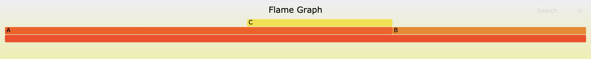

🚧 This note is still work in progress, please come back later! 🚧

# CPU Profiling in Go

## How it works

Go's CPU profiler works by sampling the profiled program at a configurable rate of 100 Hz. A sample consists mostly of the stack trace of the goroutine that was interrupted. Below is an example of a program that has a function `A()` that sometimes calls function `C()` and `B()` which doesn't call anything.

```
------------------------------------> time
|  |  |  |  |  |  |  |  |  |  |  |
A  B  A  B  A  A  A  B  A  B  A  A
      C        C        C

<-->
10ms
```

The resulting [pprof output](./pprof.md) doesn't contain the raw sample events. Instead it aggregates all samples and reports the **samples/count** and **cpu/nanoseconds** values. The latter is [derrived](https://github.com/golang/go/blob/go1.15.6/src/runtime/pprof/proto.go#L354) by multiplying the sample count with the sample period and is therefore redundant. I suspect it's included because pprof doesnt support the count to time conversion, but if anybody has the full story please let me know!

Back to the example above, the pprof output file would containing the following:

| stack trace | samples/count | cpu/nanoseconds |
| ----------- | ------------- | --------------- |
| A           | 5             | 50000000        |
| A C         | 3             | 30000000        |
| B           | 4             | 40000000        |

Please note that the **stack trace** is a bit more complex in reality as it includes the exact program counter address at which your program was sampled as well as the line number in your code that it maps to. This information is usually omitted when visualizing the data as a [Flame Graph](http://www.brendangregg.com/flamegraphs.html), but can be very useful when drilling down into the details. Speaking of flame graphs, here is what the data above looks like when visualized:



## Usage

The various ways one can record CPU profiles in Go are listed below.

1. The `go test` command has a `-cpuprofile` flag described that can be used to profile the benchmarks in your test suite like shown below. You can also [add a flag like this](https://golang.org/pkg/runtime/pprof/#hdr-Profiling_a_Go_program) to you own programs which might makes sense for command line tools.

   ```
   go test -cpuprofile benchmark.cpu.pb.gz -bench .
   go tool pprof -http=:6061 benchmark.cpu.pb.gz
   ```

2. The [net/http/pprof](net/http/pprof) allows you to setup http endpoints that can start/stop the CPU profiler via http requests on-demand and return the resulting pprof data file. You can directly pass a URL to such an endpoint to the pprof tool.

   ```
   go tool pprof -http=:6061 http://localhost:6060/debug/pprof/profile?seconds=30
   ```

3. You can programmatically start/stop the profiler via the [runtime/pprof API](https://golang.org/pkg/runtime/pprof/#StartCPUProfile).

   ```go
   pprof.StartCPUProfile(outputFile)
   defer pprof.StopCPUProfile()
   // <code to profile>
   ```

4. You can use a service such as [Datadog's Continious Profiler](https://www.datadoghq.com/product/code-profiling/) to automatically take and upload CPU profiles of your applications running in production. Disclaimer: I just started working for Datadog to take Go profiling to the next level.

## Use Cases

- Break down CPU utilization by functions or even line numbers.
- Break down CPU utilization by user-dimensions (endpoint, request_id, etc.) using [profiler labels](https://rakyll.org/profiler-labels/).

## Anti-Use Cases

- Understanding [Off-CPU](http://www.brendangregg.com/offcpuanalysis.html) time your program spends while waiting on I/O, Locks, Timers, Scheduling, etc.
- High-resolution sampling. The default rate is 100 Hz and you won't be able to go much higher for reasons outlined later on.

## Todo

- Talk about multi threading.
- setitimer
- Profiler labels
- bias
- performance overhead (including negative!)
  - https://github.com/golang/go/issues/38325
- accuracy
  - https://github.com/golang/go/issues/35057
- Discuss [Proposal: hardware performance counters for CPU profiling.](https://go.googlesource.com/proposal/+/refs/changes/08/219508/2/design/36821-perf-counter-pprof.md)

## Disclaimers

I work at [Datadog](https://www.datadoghq.com/) on [Continuous Profiling](https://www.datadoghq.com/product/code-profiling/) for Go. You should check it out. We're also [hiring](https://www.datadoghq.com/jobs-engineering/#all&all_locations) : ).

The information on this page is believed to be correct, but no warranty is provided. Feedback is welcome!