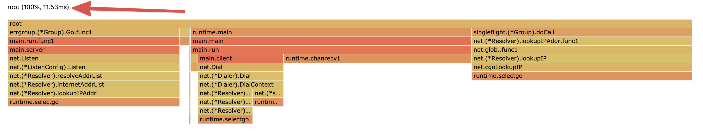

# block-net

This [program](./main.go) explores the [question](https://twitter.com/rogpeppe/status/1359202847708037124) whether network i/o (e.g. waiting on socket read/write operations) will show up in the [block profiler](../block.md) or not.

The program does the following:

1. Start a TCP server via `net.Listen()` and wait for a client using `l.Accept()`.
2. Sleep for 1s
3. Connect to the TCP server with a client using `net.Dial()`.
4. Let the server wait for a message from the client using `conn.Read()`
4. Sleep for 1s
5. Send a `"hello world"` message from the client to the server using `conn.Write()`
6. Server prints the message it received
7. Program exits

Given this program and assuming the block profiler captures network i/o, we'd expect to capture two major blocking events:

1. `l.Accept()` waiting for 1s before a client connects.
2. `conn.Read()` waiting for 1s before receiving a message from the client

However, as you can see below, the block profiler [captures](./block.pb.gz) only `~12ms` of activity related to channel operations involved in the listen/dial process. The accept/read activity however remains completely invisible.

This means that [block profiler](../block.md) is generally not able to give a good idea about goroutines that are waiting on network i/o. 

