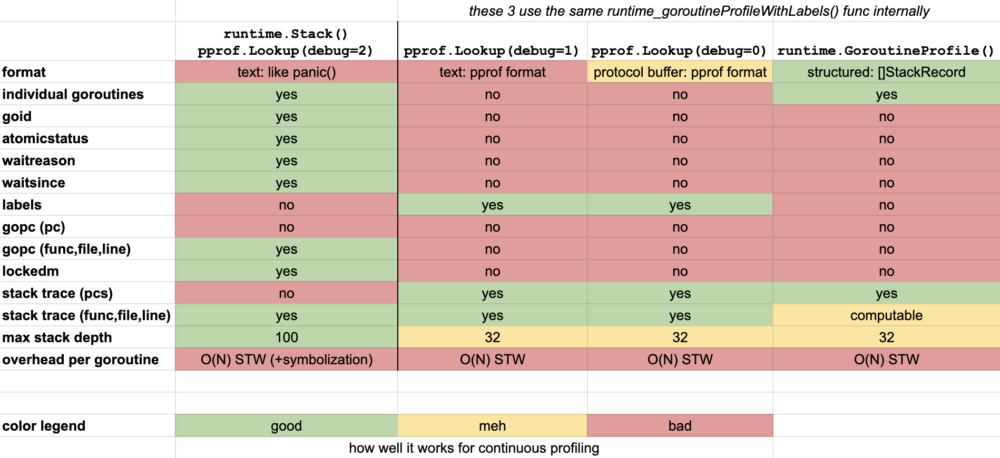

This document was last updated for `go1.15.6` but probably still applies to older/newer versions for the most parts.

# Goroutine Profiling in Go

Go has various APIs to provide users with a list of **active** goroutines, their current stack trace, as well as various other properties. Some APIs expose this information as statistical summaries, while other APIs provide information for each individual goroutine.

Despite the differences between the APIs, the [common](https://github.com/golang/go/blob/9b955d2d3fcff6a5bc8bce7bafdc4c634a28e95b/src/runtime/mprof.go#L729) [definition](https://github.com/golang/go/blob/9b955d2d3fcff6a5bc8bce7bafdc4c634a28e95b/src/runtime/traceback.go#L931) of an **active** goroutine seems to be:

- It's not [`dead`](https://github.com/golang/go/blob/go1.15.6/src/runtime/runtime2.go#L65-L71) (just exited or is being reinitialized).
- It's not a [system goroutine](https://github.com/golang/go/blob/9b955d2d3fcff6a5bc8bce7bafdc4c634a28e95b/src/runtime/traceback.go#L1013-L1021) nor finalizer goroutine.

In other words, goroutines that are running, waiting on locks, i/o, scheduling, etc. are all considered to be active, even so one might naively not think of them as such.

## Performance Impact

All Goroutine profiling available in Go requires an `O(N)` **stop-the-world** phase where `N` is the number of allocated goroutines. A [naive benchmark](https://github.com/felixge/fgprof/blob/fe01e87ceec08ea5024e8168f88468af8f818b62/fgprof_test.go#L35-L78) [indicates](https://github.com/felixge/fgprof/blob/master/BenchmarkProfilerGoroutines.txt) that the world is stopped for ~1µs per goroutine when using the [runtime.GoroutineProfile()](https://golang.org/pkg/runtime/#GoroutineProfile) API. But this number is likely to fluctuate in response to other factors such as the average stack depth of the program.

As a rule of thumb, applications that are extremely latency sensitive and make use of thousands of active goroutines might want to be a little careful with goroutine profiling in production. That being said, large number of goroutines, and perhaps even Go itself, might not be good idea for such applications to begin with.

Most applications that can tolerate a few ms of ocassional extra latency should have no issues with continous goroutine profiling in production.

## Goroutine Properties

Goroutines have a lot of [properties](https://github.com/golang/go/blob/go1.15.6/src/runtime/runtime2.go#L406-L486) that can help to debug Go applications. The ones below are particulary interesting and exposed via the APIs described later on in this document to varying degrees.

- [`goid`](https://github.com/golang/go/blob/go1.15.6/src/runtime/runtime2.go#L428): The unique id of the goroutine, the main goroutine has id `1`.
- [`atomicstatus`](https://github.com/golang/go/blob/go1.15.6/src/runtime/runtime2.go#L14-L105): The status of the goroutine, one of the following:
  - `idle`: just got allocated
  - `runnable`: on a run queue, waiting to be scheduled
  - `running`: executing on an OS thread
  - `syscall`: blocked on a syscall
  - `waiting`: parked by the scheduler, see `g.waitreason` 
  - `dead`: just exited or being reinitialized
  - `copystack`: stack is currently being moved
  - `preempted`: just preempted itself
- [`waitreason`](https://github.com/golang/go/blob/go1.15.6/src/runtime/runtime2.go#L996-L1024): The reason a goroutine is in `waiting` status, e.g. sleep, channel operations, i/o, gc, etc.
- [`waitsince`](https://github.com/golang/go/blob/go1.15.6/src/runtime/runtime2.go#L430): The approximate timestamp a goroutine has entered `waiting` or `syscall` status as determined by the first gc after the wait started.
- [`labels`](https://github.com/golang/go/blob/go1.15.6/src/runtime/runtime2.go#L472): A set of key/value [profiler labels](https://rakyll.org/profiler-labels/) that can be attached to goroutines.
- `stack trace`:  The function that is currently being executed as well as its callers. This is exposed as either a plain text output of filenames, function names and line numbers or a slice of program counter addresses (pcs).  🚧 *Research more details on this, e.g. can func/file/line text be converted to pcs?*
- [`gopc`](https://github.com/golang/go/blob/go1.15.6/src/runtime/runtime2.go#L466): The program counter address (pc) of the `go ...` call that caused this goroutine to be created. Can be converted to the file, function name and line number.
- [`lockedm`](https://github.com/golang/go/blob/go1.15.6/src/runtime/runtime2.go#L460): The thread this goroutine is locked to, if any.

The feature matrix below give you a quick idea on the current availability of these properties through the various APIs. Also available as a [google sheet](https://docs.google.com/spreadsheets/d/1txMRjhDA0NC9eSNRRUMMFI5uWJ3FBnACGVjXYT1gKig/edit?usp=sharing).



## APIs

### [`runtime.Stack()`](https://golang.org/pkg/runtime/#Stack) /  [`pprof.Lookup(debug=2)`](https://golang.org/pkg/runtime/pprof/#Lookup)

This returns unstructured text output showing the stack of all active goroutines as well as the properties listed in the feature matrix above.

The `waitsince` property is included as `nanotime() - gp.waitsince()` in minutes, but only if the duration exceeds 1 minute.

`pprof.Lookup(debug=2)` is a simplified alias for how this profile is used. The actual invocation looks like this:

```go
profile := pprof.Lookup("goroutine")
profile.WriteTo(os.Stdout, 2)
```

The profile implementation itself simply invokes `runtime.Stack()`.

Below is a truncated example of the returned output, see [2.runtime.stack.txt](./examples/goroutine/2.runtime.stack.txt) for a full example.

```
goroutine 1 [running]:
main.glob..func1(0x14e5940, 0xc0000aa7b0, 0xc000064eb0, 0x2)
	/Users/felix.geisendoerfer/go/src/github.com/felixge/go-profiler-notes/examples/goroutine/main.go:29 +0x6f
main.writeProfiles(0x2, 0xc0000c4008, 0x1466424)
	/Users/felix.geisendoerfer/go/src/github.com/felixge/go-profiler-notes/examples/goroutine/main.go:106 +0x187
main.main()
	/Users/felix.geisendoerfer/go/src/github.com/felixge/go-profiler-notes/examples/goroutine/main.go:152 +0x3d2

goroutine 22 [sleep, 1 minutes]:
time.Sleep(0x3b9aca00)
	/usr/local/Cellar/go/1.15.6/libexec/src/runtime/time.go:188 +0xbf
main.shortSleepLoop()
	/Users/felix.geisendoerfer/go/src/github.com/felixge/go-profiler-notes/examples/goroutine/main.go:165 +0x2a
created by main.indirectShortSleepLoop2
	/Users/felix.geisendoerfer/go/src/github.com/felixge/go-profiler-notes/examples/goroutine/main.go:185 +0x35

goroutine 3 [IO wait, 1 minutes]:
internal/poll.runtime_pollWait(0x1e91e88, 0x72, 0x0)
	/usr/local/Cellar/go/1.15.6/libexec/src/runtime/netpoll.go:222 +0x55
internal/poll.(*pollDesc).wait(0xc00019e018, 0x72, 0x0, 0x0, 0x1465786)
	/usr/local/Cellar/go/1.15.6/libexec/src/internal/poll/fd_poll_runtime.go:87 +0x45
internal/poll.(*pollDesc).waitRead(...)
	/usr/local/Cellar/go/1.15.6/libexec/src/internal/poll/fd_poll_runtime.go:92
internal/poll.(*FD).Accept(0xc00019e000, 0x0, 0x0, 0x0, 0x0, 0x0, 0x0, 0x0)
	/usr/local/Cellar/go/1.15.6/libexec/src/internal/poll/fd_unix.go:394 +0x1fc

...
```

### [`pprof.Lookup(debug=1)`](https://golang.org/pkg/runtime/pprof/#Lookup)

This profiling method is invoked the same way as `pprof.Lookup(debug=2)`, but produces very different data:

- Instead of listing individual goroutines, goroutines with the same stack/labels are listed once along with their count.
- pprof labels are included (`debug=2` does not include them).
- Most other goroutine properties from debug=2 are not included.
- The output format is also text based, but looks very different than `debug=2`.

Below is a truncated example of the returned output, see [2.pprof.lookup.goroutine.debug1.txt](./examples/goroutine/2.pprof.lookup.goroutine.debug1.txt) for a full example.

```
goroutine profile: total 9
2 @ 0x103b125 0x106cd1f 0x13ac44a 0x106fd81
# labels: {"test_label":"test_value"}
#	0x106cd1e	time.Sleep+0xbe			/usr/local/Cellar/go/1.15.6/libexec/src/runtime/time.go:188
#	0x13ac449	main.shortSleepLoop+0x29	/Users/felix.geisendoerfer/go/src/github.com/felixge/go-profiler-notes/examples/goroutine/main.go:165

1 @ 0x103b125 0x10083ef 0x100802b 0x13ac4ed 0x106fd81
# labels: {"test_label":"test_value"}
#	0x13ac4ec	main.chanReceiveForever+0x4c	/Users/felix.geisendoerfer/go/src/github.com/felixge/go-profiler-notes/examples/goroutine/main.go:177

1 @ 0x103b125 0x103425b 0x106a1d5 0x10d8185 0x10d91c5 0x10d91a3 0x11b8a8f 0x11cb72e 0x12df52d 0x11707c5 0x117151d 0x1171754 0x1263c2c 0x12d96ca 0x12d96f9 0x12e09ba 0x12e5085 0x106fd81
#	0x106a1d4	internal/poll.runtime_pollWait+0x54		/usr/local/Cellar/go/1.15.6/libexec/src/runtime/netpoll.go:222
#	0x10d8184	internal/poll.(*pollDesc).wait+0x44		/usr/local/Cellar/go/1.15.6/libexec/src/internal/poll/fd_poll_runtime.go:87
#	0x10d91c4	internal/poll.(*pollDesc).waitRead+0x1a4	/usr/local/Cellar/go/1.15.6/libexec/src/internal/poll/fd_poll_runtime.go:92
#	0x10d91a2	internal/poll.(*FD).Read+0x182			/usr/local/Cellar/go/1.15.6/libexec/src/internal/poll/fd_unix.go:159
#	0x11b8a8e	net.(*netFD).Read+0x4e				/usr/local/Cellar/go/1.15.6/libexec/src/net/fd_posix.go:55
#	0x11cb72d	net.(*conn).Read+0x8d				/usr/local/Cellar/go/1.15.6/libexec/src/net/net.go:182
#	0x12df52c	net/http.(*connReader).Read+0x1ac		/usr/local/Cellar/go/1.15.6/libexec/src/net/http/server.go:798
#	0x11707c4	bufio.(*Reader).fill+0x104			/usr/local/Cellar/go/1.15.6/libexec/src/bufio/bufio.go:101
#	0x117151c	bufio.(*Reader).ReadSlice+0x3c			/usr/local/Cellar/go/1.15.6/libexec/src/bufio/bufio.go:360
#	0x1171753	bufio.(*Reader).ReadLine+0x33			/usr/local/Cellar/go/1.15.6/libexec/src/bufio/bufio.go:389
#	0x1263c2b	net/textproto.(*Reader).readLineSlice+0x6b	/usr/local/Cellar/go/1.15.6/libexec/src/net/textproto/reader.go:58
#	0x12d96c9	net/textproto.(*Reader).ReadLine+0xa9		/usr/local/Cellar/go/1.15.6/libexec/src/net/textproto/reader.go:39
#	0x12d96f8	net/http.readRequest+0xd8			/usr/local/Cellar/go/1.15.6/libexec/src/net/http/request.go:1012
#	0x12e09b9	net/http.(*conn).readRequest+0x199		/usr/local/Cellar/go/1.15.6/libexec/src/net/http/server.go:984
#	0x12e5084	net/http.(*conn).serve+0x704			/usr/local/Cellar/go/1.15.6/libexec/src/net/http/server.go:1851

...
```

### [`pprof.Lookup(debug=0)`](https://golang.org/pkg/runtime/pprof/#Lookup)

This profiling method is invoked the same way as `pprof.Lookup(debug=1)`, and produces the same data. The only difference is that the data format is the [pprof](./pprof.md) protocol buffer format.

Below is a truncated example of the returned output as reported by `go tool pprof -raw`, see [2.pprof.lookup.goroutine.debug0.pb.gz](./examples/goroutine/2.pprof.lookup.goroutine.debug0.pb.gz) for a full example.

```
PeriodType: goroutine count
Period: 1
Time: 2021-01-14 16:46:23.697667 +0100 CET
Samples:
goroutine/count
          2: 1 2 3 
                test_label:[test_value]
          1: 1 4 5 6 
                test_label:[test_value]
          1: 1 7 8 9 10 11 12 13 14 15 16 17 18 19 20 
          1: 1 7 8 9 10 11 12 21 14 22 23 
                test_label:[test_value]
          1: 1 7 8 9 24 25 26 27 28 29 30 
          1: 1 31 32 
                test_label:[test_value]
          1: 1 2 33 
                test_label:[test_value]
          1: 34 35 36 37 38 39 40 41 
                test_label:[test_value]
Locations
     1: 0x103b124 M=1 runtime.gopark /usr/local/Cellar/go/1.15.6/libexec/src/runtime/proc.go:306 s=0
     2: 0x106cd1e M=1 time.Sleep /usr/local/Cellar/go/1.15.6/libexec/src/runtime/time.go:188 s=0
     3: 0x13ac449 M=1 main.shortSleepLoop /Users/felix.geisendoerfer/go/src/github.com/felixge/go-profiler-notes/examples/goroutine/main.go:165 s=0
     4: 0x10083ee M=1 runtime.chanrecv /usr/local/Cellar/go/1.15.6/libexec/src/runtime/chan.go:577 s=0
     5: 0x100802a M=1 runtime.chanrecv1 /usr/local/Cellar/go/1.15.6/libexec/src/runtime/chan.go:439 s=0
     6: 0x13ac4ec M=1 main.chanReceiveForever /Users/felix.geisendoerfer/go/src/github.com/felixge/go-profiler-notes/examples/goroutine/main.go:177 s=0
...
Mappings
1: 0x0/0x0/0x0   [FN]
```

### [`runtime.GoroutineProfile()`](https://golang.org/pkg/runtime/#GoroutineProfile)

This function essentially returns a slice of all active goroutines and their current stack trace. The stack traces are given in the form of program addresses which can be resolved to function names using [`runtime.CallersFrames()`](https://golang.org/pkg/runtime/#CallersFrames).

This method is used by [fgprof](https://github.com/felixge/fgprof) to implement wall clock profiling.

The following features are not available, but might be interesting to propose to the Go project in the future:

- Include goroutine properties outlined above that are not available yet, especially labels.
- Filter by pprof labels, this could reduce stop-the-world, but would require additional book keeping by the runtime.
- Limit the number of returned goroutines to a random subset, could also reduce stop-the-world and might be easier to implement than filtering by label.

Below is a truncated example of the returned output, see [2.runtime.goroutineprofile.json](./examples/goroutine/2.runtime.goroutineprofile.json) for a full example.

```json
[
  {
    "Stack0": [
      20629256,
      20629212,
      20627047,
      20628306,
      17018153,
      17235329,
      // ...
    ]
  },
  {
    "Stack0": [
      17019173,
      17222943,
      20628554,
      17235329,
      // ...
    ]
  },
  // ...
]
```

### [`net/http/pprof`](https://golang.org/pkg/net/http/pprof/)

This package exposes the [`pprof.Lookup("goroutine")`](https://golang.org/pkg/runtime/pprof/#Lookup) profiles described above via HTTP endpoints. The output is identical.

## Disclaimer

I've just started a new job at [Datadog](https://www.datadoghq.com/) to work on [Continuous Profiling](https://www.datadoghq.com/product/code-profiling/) for Go. This document may not reflect the views of my employer, but they were kind enough to let me publish it : ).
