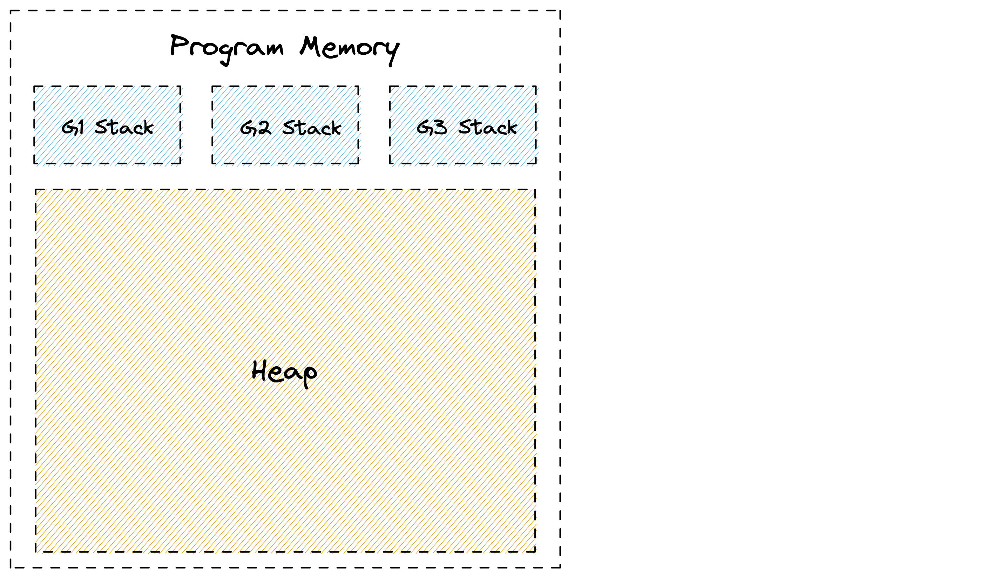
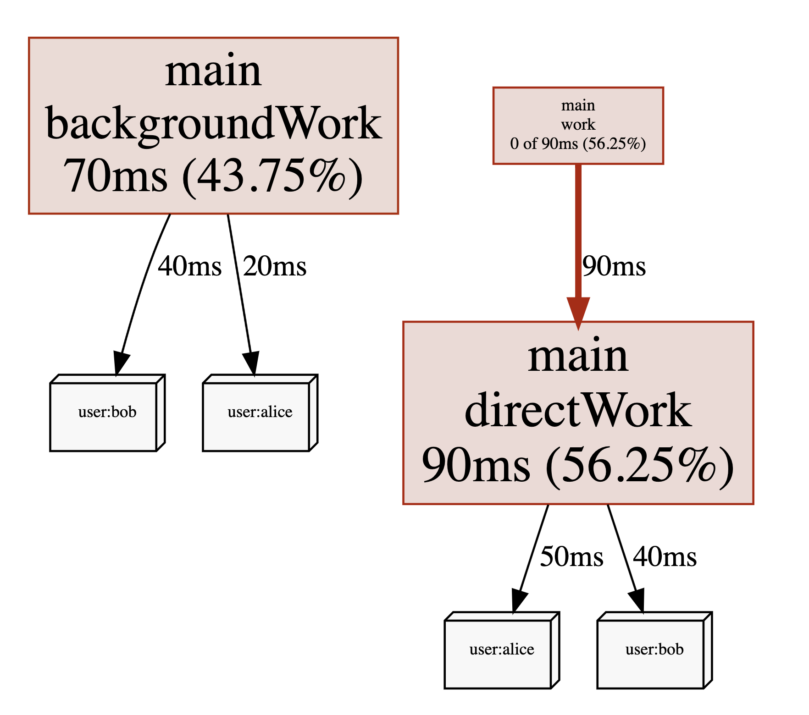

⬅ [Index of all go-profiler-notes](../README.md)
# The Busy Developer's Guide to Go Profiling, Tracing and Observability

- **[Introduction](#introduction):** [Read This](#read-this) · [Mental Model for Go](#mental-model-for-go) · Profiling vs Tracing
- **Use Cases:** Reduce Costs · Reduce Latency · Memory Leaks · Program Hanging · Outages
- **[Go Profilers](#go-profilers)**: [CPU](#cpu-profiler) · [Memory](#memory-profiler) · [Block](#block-profiler) · [Mutex](#mutex-profiler) · [Goroutine](#goroutine-profiler) · [ThreadCreate](#threadcreate-profiler)
- **Viewing Profiles**: Command Line · Flame Graph · Graph
- **Go Execution Tracer:** Timeline View · Derive Profiles
- **Go Metrics:**  MemStats
- **Other Tools:** time · perf · bpftrace
- **[Advanced Topics](#advanced-topics):** Assembly · [Stack Traces](#stack-traces) · [pprof Format](#pprof-format) · Little's Law
- **Datadog Products:** Continuous Profiler · APM (Distributed Tracing) · Metrics

🚧 This document is a work in progress. All sections above will become clickable links over time. The best way to find out about updates is to follow me and [my thread on twitter](https://twitter.com/felixge/status/1435537024388304900) where I'll announce new sections being added.

# Introduction

## Read This

This is a practical guide aimed at busy gophers interested in improving their programs using profiling, tracing and other observability techniques. If you're not well versed in the internals of Go, it is recommended that you read the entire introduction first. After that you should feel free to jump to any section you are interested in.
## Mental Model for Go

It is possible to become quite proficient in writing Go code without understanding how the language works under the hood. But when it comes to performance and debugging, you'll hugely benefit from having a mental model of the internals. Therefore we'll begin with laying out a rudimentary model of Go below. This model should be good enough to allow you to avoid the most common mistakes, but [all models are wrong](https://en.wikipedia.org/wiki/All_models_are_wrong), so you are encouraged to seek out more in-depth material to tackle harder problems in the future.

Go's primary job is to multiplex and abstract hardware resources, similar to an operating system. This is generally accomplished using two major abstractions:

1. **Goroutine Scheduler:** Manages how your code is being executed on the CPUs of your system.
2. **Garbage Collector:** Provides virtual memory that is automatically freed as needed.


### Goroutine Scheduler

Let's talk about the scheduler first using the example below:

```go
func main() {
    res, err := http.Get("https://example.org/")
    if err != nil {
        panic(err)
    }
    fmt.Printf("%d\n", res.StatusCode)
}
```

Here we have a single goroutine, let's call it `G1`, that runs the `main` function. The picture below shows a simplified timeline of how this goroutine might execute on a single CPU. Initially `G1` is running on the CPU to prepare the http request. Then the CPU becomes idle as the goroutine has to wait for the network. And finally it gets scheduled onto the CPU again to print out the status code.


From the scheduler's perspective, the program above executes like shown below. At first `G1` is `Executing` on `CPU 1`. Then the goroutine is taken off the CPU while `Waiting` for the network. Once the scheduler notices that the network has replied (using non-blocking I/O, similar to Node.js), it marks the goroutine as `Runnable`. And as soon as a CPU core becomes available, the goroutine starts `Executing` again. In our case all cores are available, so `G1` can go back to `Executing` the `fmt.Printf()` function on one of the CPUs immediately without spending any time in the `Runnable` state.


Most of the time, Go programs are running multiple goroutines, so you will have a few goroutines `Executing` on some of the CPU cores, a large number of goroutines `Waiting` for various reasons, and ideally no goroutines `Runnable` unless your program exhibits very high CPU load. An example of this can be seen below.


Of course the model above glosses over many details. In reality it's turtles all the way down, and the Go scheduler works on top of threads managed by the operating system, and even CPUs themselves are capable of hyper-threading which can be seen as a form of scheduling. So if you're interested, feel free to continue down this rabbit hole via Ardan labs series on [Scheduling in Go](https://www.ardanlabs.com/blog/2018/08/scheduling-in-go-part1.html) or similar material.

However, the model above should be sufficient to understand the remainder of this guide. In particular it should become clear that the time measured by the various Go profilers is essentially the time your goroutines are spending in the `Executing` and `Waiting` states as illustrated by the diagram below.


### Garbage Collector

The other major abstraction in Go is the garbage collector. In languages like C, the programmer needs to manually deal with allocating and releasing memory using `malloc()` and `free()`. This offers great control, but turns out to be very error prone in practice. A garbage collector can reduce this burden, but the automatic management of memory can easily become a performance bottleneck. This section of the guide will present a simple model for Go's GC that should be useful for identifying and optimizing memory management related problems.

#### The Stack

Let's start with the basics. Go can allocate memory in one of two places, the stack or the heap. Each goroutine has its own stack which is a contiguous area of memory. Additionally there is a big area of memory shared between goroutines that is called the heap. This can be seen in the picture below.



When a function calls another function it gets its own section on the stack called a stack frame where it can place things like local variables. A stack pointer is used to identify the next free spot in the frame. When a function returns, the data from the last frame is discarded by simply moving the stack pointer back to end of the previous frame. The frame's data itself can linger on the stack, and gets overwritten by the next function call. This is very simple and efficient as Go doesn't have to keep track of each variable.

To make this a little more intuitive, let's look at the example below:

```go
func main() {
	sum := 0
	sum = add(23, 42)
	fmt.Println(sum)
}

func add(a, b int) int {
	return a + b
}
```

Here we have a `main()` function that starts out by reserving some space on the stack for the variable `sum`. When the `add()` function gets called, it gets its own frame to hold the local `a` and `b` parameters. Once the `add()` returns, its data is discarded by moving the stack pointer back to the end of the `main()` function's frame, and the `sum` variable gets updated with the result. Meanwhile the old values of `add()` linger beyond the stack pointer to be overwritten by the next function call. Below is a visualization of this process:


The example above is highly simplified and omits many details around return values, frame pointers, return addresses and function inlining. In fact, as of Go 1.17, the program above may not even need any space on the stack as the small amount of data can be managed using CPU registers by the compiler. But that's okay. This model should still give you a reasonable intuition for the way non-trivial Go programs allocate and discard local variables on the stack.

One thing you might wonder at this point is what happens if you run out of space on the stack. In languages like C this would cause a stack overflow error. Go on the other hand automatically deals with this problem by making a copy of the stack that's twice as big. This allows goroutines to start out with very small, typically 2 KiB stacks, and is one of the key ingredients for [making goroutines more scalable](https://golang.org/doc/faq#goroutines) than operating system threads.

Another aspect of the stack is how it's involved in creating stack traces. This is a bit more advanced, but if you're interested check out the [Stack Traces in Go](../stack-traces.md) document in this repo.

#### The Heap

Stack allocations are great, but there are many situations where Go can't utilize them. The most common one is returning a pointer to a local variable of a function. This can be seen in this modified version of our `add()` example from above:

```go
func main() {
	fmt.Println(*add(23, 42))
}

func add(a, b int) *int {
	sum := a + b
	return &sum
}
```

Normally Go would be able to allocate the `sum` variable inside of the `add()` function on the stack. But as we've learned, this data gets discarded when the `add()` function returns. So in order to safely return a `&sum` pointer, Go has to allocate the memory for it from outside of the stack. And that's where the heap comes in.

The heap is used for storing data that might outlive the function that creates it, as well as for any data that is shared between goroutines using pointers. However, this raises the question of how this memory gets freed. Because unlike stack allocations, heap allocations can't be discarded when the function that created them returns.

Go solves this problem using its built-in garbage collector. The details of its implementation are very complex, but from a birds eye view, it keeps track of your memory as shown in the picture below. Here you can see three goroutines that have pointers to green allocations on the heap. Some of these allocations also have pointers to other allocations shown in green. Additionally there are grey allocations that may point to the green allocations or each other, but they are not referenced by a green allocation themselves. Those allocations were once reachable, but are now considered to be garbage. This can happen if the function that allocated their pointers on the stack returned, or their value was overwritten. The GC is responsible for automatically identifying and freeing those allocations.


Performing GC involves a lot of expensive graph traversal and cache thrashing. It even requires regular stop-the-world phases that halt the execution of your entire program. Luckily recent versions of Go have gotten this down to fractions of a millisecond, but much of the remaining overhead is inherent to any GC. In fact, it's not uncommon that 20-30% of a Go program's execution are spend on memory management.

Generally speaking the cost of GC is proportional to the amount of heap allocations your program performs. So when it comes to optimizing the memory related overhead of your program, the mantra is:

- **Reduce**: Try to turn heap allocations into stack allocations or avoid them altogether. Minimizing the number of pointers on the heap also helps.
- **Reuse:** Reuse heap allocations rather than replacing them with new ones.
- **Recycle:** Some heap allocations can't be avoided. Let the GC recycle them and focus on other issues.

As with the previous mental model in this guide, everything above is an extremely simplified view of reality. But hopefully it will be good enough to make sense out of the remainder of this guide, and inspire you to read more articles on the subject. One article you should definitely read is [Getting to Go: The Journey of Go's Garbage Collector](https://go.dev/blog/ismmkeynote) which gives you a good idea of how Go's GC has advanced over the years, and the pace at which it is improving.

# Go Profilers

Here is an overview of the profilers built into the Go runtime. For more details following the links.

| | [CPU](#cpu-profiler) | [Memory](#memory-profiler) | [Block](#block-profiler) | [Mutex](#mutex-profiler) | [Goroutine](#goroutine-profiler) | [ThreadCreate](#threadcreate-profiler) |
|-|-|-|-|-|-|-|
|Production Safety|✅|✅|✅|✅|⚠️ (1.)|🐞 (2.)|
|Safe Rate|default|default|`10000`|`100`|`1000` goroutines|-|
|Accuracy|⭐️⭐|⭐⭐⭐|⭐⭐⭐|⭐⭐⭐|⭐⭐⭐|-|
|Max Stack Depth|`64`|`32`|`32`|`32`|`32` - `100` (3.)|-|
|Profiler Labels|✅|❌|❌|❌|✅|-|

1. One O(N) stop-the-world pauses where N is the number of goroutines. Expect ~1-10µsec pause per goroutine.
2. Totally broken, don't try to use it.
3. Depends on the API.

<!-- TODO mega snippet to enable all profilers -->

## CPU Profiler

Go's CPU profiler can help you identify which parts of your code base consume a lot of CPU time.

⚠️ Please note that CPU time is usually different from the real time experienced by your users (aka latency). For example a typical http request might take `100ms` to complete, but only consume `5ms` of CPU time while waiting for `95ms` on a database. It's also possible for a request to take `100ms`, but spend `200ms` of CPU if two goroutines are performing CPU intensive work in parallel. If this is confusing to you, please refer to the [Goroutine Scheduler](#goroutine-scheduler) section.

You can control the CPU profiler via various APIs:

- `go test -cpuprofile cpu.pprof` will run your tests and write a CPU profile to a file named `cpu.pprof`.
- [`pprof.StartCPUProfile(w)`](https://pkg.go.dev/runtime/pprof#StartCPUProfile) captures a CPU profile to `w` that covers the time span until [`pprof.StopCPUProfile()`](https://pkg.go.dev/runtime/pprof#StopCPUProfile) is called.
- [`import _ "net/http/pprof"`](https://pkg.go.dev/net/http/pprof) allows you to request a 30s CPU profile by hitting the `GET /debug/pprof/profile?seconds=30` endpoint of the default http server that you can start via `http.ListenAndServe("localhost:6060", nil)`.
- [`runtime.SetCPUProfileRate()`](https://pkg.go.dev/runtime#SetCPUProfileRate) lets you to control the sampling rate of the CPU profiler. See [CPU Profiler Limitations](#cpu-profiler-limitations) for current limitations.
- [`runtime.SetCgoTraceback()`](https://pkg.go.dev/runtime#SetCgoTraceback) can be used to get stack traces into cgo code. [benesch/cgosymbolizer](https://github.com/benesch/cgosymbolizer) has an implementation for Linux and macOS.

If you need a quick snippet to paste into your `main()` function, you can use the code below:

```go
file, _ := os.Create("./cpu.pprof")
pprof.StartCPUProfile(file)
defer pprof.StopCPUProfile()
```

Regardless of how you activate the CPU profiler, the resulting profile will essentially be a table of stack traces formatted in the binary [pprof](../pprof.md) format. A simplified version of such a table is shown below:

|stack trace|samples/count|cpu/nanoseconds|
|-|-|-|
|main;foo|5|50000000|
|main;foo;bar|3|30000000|
|main;foobar|4|40000000|

The CPU profiler captures this data by asking the operating system to monitor the CPU usage of the application and sends it a `SIGPROF` signal for every `10ms` of CPU time it consumes. The OS also includes time consumed by the kernel on behalf of the application in this monitoring. Since the signal deliver rate depends on CPU consumption, it's dynamic and can be up to `N * 100Hz` where `N` is the number of logical CPU cores on the system. When a `SIGPROF` signal arrives, Go's signal handler captures a stack trace of the currently active goroutine, and increments the corresponding values in the profile. The `cpu/nanoseconds` value is currently directly derived from the sample count, so it is redundant, but convenient.

### CPU Profiler Labels

A cool feature of Go's CPU profiler is that you can attach arbitrary key value pairs to a goroutine. These labels will be inherited by any goroutine spawned from that goroutine and show up in the resulting profile.

Let's consider the [example](./cpu-profiler-labels.go) below that does some CPU `work()` on behalf of a `user`. By using the [`pprof.Labels()`](https://pkg.go.dev/runtime/pprof#Labels) and [`pprof.Do()`](https://pkg.go.dev/runtime/pprof#Do) API, we can associate the `user` with the goroutine that is executing the `work()` function. Additionally the labels are automatically inherited by any goroutine spawned within the same code block, for example the `backgroundWork()` goroutine.

```go
func work(ctx context.Context, user string) {
	labels := pprof.Labels("user", user)
	pprof.Do(ctx, labels, func(_ context.Context) {
		go backgroundWork()
		directWork()
	})
}
```

The resulting profile will include a new label column and might look something like this:

|stack trace|label|samples/count|cpu/nanoseconds|
|-|-|-|-|
|main.childWork|user:bob|5|50000000|
|main.childWork|user:alice|2|20000000|
|main.work;main.directWork|user:bob|4|40000000|
|main.work;main.directWork|user:alice|3|30000000|

Viewing the same profile with pprof's Graph view will also include the labels:



How you use these labels is up to you. You might include things such as `user ids`, `request ids`, `http endpoints`, `subscription plan` or other data that can allow you to get a better understanding of what types of requests are causing high CPU utilization, even when they are being processed by the same code paths. That being said, using labels will increase the size of your pprof files. So you should probably start with low cardinality labels such as endpoints before moving on to high cardinality labels once you feel confident that they don't impact the performance of your application.

⚠️ Go 1.17 and below contained several bugs that could cause some profiler labels to be missing from CPU profiles, see [CPU Profiler Limitations](#cpu-profiler-limitations) for more information.

### CPU Utilization

Since the sample rate of the CPU profiler adapts to amount of CPU your program is consuming, you can derive the CPU utilization from CPU profiles. In fact pprof will do this automatically for you. For example the profile below was taking from a program that had an average CPU utilization of `147.77%`:

```
$ go tool pprof guide/cpu-utilization.pprof
Type: cpu
Time: Sep 9, 2021 at 11:34pm (CEST)
Duration: 1.12s, Total samples = 1.65s (147.77%)
Entering interactive mode (type "help" for commands, "o" for options)
(pprof) 
```

Another popular way to express CPU utilization is CPU cores. In the example above the program was using an average of `1.47` CPU cores during the profiling period.

⚠️ In Go 1.17 and below you shouldn't put too much trust in this number if it's near or higher than `250%`, see [CPU Profiler Limitations](#cpu-profiler-limitations). However, if you see a very low number such as `10%` this usually indicates that CPU consumption is not an issue for your application. A common mistake is to ignore this number and start worrying about a particular function taking up a long time relative to the rest of the profile. This is usually a waste of time when overall CPU utilization is low, as not much can be gained from optimizing this function.

### System Calls in CPU Profiles

If you see system calls such as `syscall.Read()` or `syscall.Write()` using a lot of time in your CPU profiles, please note that this is only the CPU time spend inside of these functions in the kernel. The I/O time itself is not being tracked. Spending a lot of time on system calls is usually a sign of making too many of them, so perhaps increasing buffer sizes can help. For more complicated situations like this, you should consider using Linux perf, as it can also show you kernel stack traces that might provide you with additional clues.

<!-- TODO: Write up some implementation details, e.g. mention setitimer(). -->
### CPU Profiler Limitations

There are a few known issues and limitations of the CPU profiler that you might want to be aware of:

- 🐞 [GH #35057](https://github.com/golang/go/issues/35057): CPU profiles taken with Go versions <= 1.17 become somewhat inaccurate for programs utilizing more than 2.5 CPU cores. Generally speaking the overall CPU utilization will be underreported, and workload spikes may be underrepresented in the resulting profile as well. This is fixed in Go 1.18. Meanwhile you could try to use Linux perf as a workaround.
- 🐞 Profiler labels in Go versions <= 1.17 suffered from several bugs.
  - [GH #48577](https://github.com/golang/go/issues/48577) and [CL 367200](https://go-review.googlesource.com/c/go/+/367200/): Labels were missing for goroutines executing on the system stack, executing C code, or making system calls.
  - [CL 369741](https://go-review.googlesource.com/c/go/+/369741): The first batch of samples in a CPU profile had an off-by-one error causing a misattribution of labels.
  - [CL 369984](https://go-review.googlesource.com/c/go/+/369984): System goroutines created on behalf of user goroutines (e.g. for garbage collection) incorrectly inherited their parents labels.
- ⚠️️ You can call [`runtime.SetCPUProfileRate()`](https://pkg.go.dev/runtime#SetCPUProfileRate) to adjust the CPU profiler rate before calling `runtime.StartCPUProfile()`. This will print a warning saying `runtime: cannot set cpu profile rate until previous profile has finished`. However, it still works within the limitation of the bug mentioned above. This issue was [initially raised here](https://github.com/golang/go/issues/40094), and there is an [accepted proposal for improving the API](https://github.com/golang/go/issues/42502).
- ⚠️ The maximum number of nested function calls that can be captured in stack traces by the CPU profiler is currently [`64`](https://sourcegraph.com/search?q=context:global+repo:github.com/golang/go+file:src/*+maxCPUProfStack+%3D&patternType=literal). If your program is using a lot of recursion or other patterns that lead to deep stack depths, your CPU profile will include stack traces that are truncated. This means you will miss parts of the call chain that led to the function that was active at the time the sample was taken.

## Memory Profiler

Go's memory profiler can help you identify which parts of your code base perform a lot of heap allocations, as well as how many of these allocations were still reachable during the last garbage collection. Because of this, the profile produced by the memory profiler is also often referred to as a heap profile.

Heap memory management related activities are often responsible for up to 20-30% of CPU time consumed by Go processes. Additionally the elimination of heap allocations can have second order effects that speed up other parts of your code due to decreasing the amount of cache thrashing that occurs when the garbage collector has to scan the heap. This means that optimizing memory allocations can often have a better return on investment than optimizing CPU-bound code paths in your program.

⚠️ The memory profiler does not show stack allocations as these are generally much cheaper than heap allocations. Please refer to the [Garbage Collector](#garbage-collector) section for more details.

You can control the memory profiler via various APIs:

- `go test -memprofile mem.pprof` will run your tests and write a memory profile to a file named `mem.pprof`.
- [`pprof.Lookup("allocs").WriteTo(w, 0)`](https://pkg.go.dev/runtime/pprof#Lookup) writes a memory profile that contains allocation events since the start of the process to `w`.
- [`import _ "net/http/pprof"`](https://pkg.go.dev/net/http/pprof) allows you to request a 30s memory profile by hitting the `GET /debug/pprof/allocs?seconds=30` endpoint of the default http server that you can start via `http.ListenAndServe("localhost:6060", nil)`. This is also called a delta profile internally.
- [`runtime.MemProfileRate`](https://pkg.go.dev/runtime#MemProfileRate) lets you to control the sampling rate of the memory profiler. See [Memory Profiler Limitations](#memory-profiler-limitations) for current limitations.

If you need a quick snippet to paste into your `main()` function, you can use the code below:

```go
file, _ := os.Create("./mem.pprof")
defer pprof.Lookup("allocs").WriteTo(file, 0)
defer runtime.GC()
```

Regardless of how you activate the Memory profiler, the resulting profile will essentially be a table of stack traces formatted in the binary [pprof](../pprof.md) format. A simplified version of such a table is shown below:

|stack trace|alloc_objects/count|alloc_space/bytes|inuse_objects/count|inuse_space/bytes|
|-|-|-|-|-|
|main;foo|5|120|2|48|
|main;foo;bar|3|768|0|0|
|main;foobar|4|512|1|128|

A memory profile contains two major pieces of information:

- `alloc_*`: The amount of allocations that your program has made since the start of the process (or profiling period for delta profiles).
- `inuse_*`: The amount of allocations that your program has made that were still reachable during the last GC.

You can use this information for various purposes. For example you can use the `alloc_*` data to determine which code paths might be producing a lot of garbage for the GC to deal with, and looking at the `inuse_*` data over time can help you with investigating memory leaks or high memory usage by your program.

<!-- TODO: mention profiles are up to two gcs old -->
### Allocs vs Heap Profile

The [`pprof.Lookup()`](https://pkg.go.dev/runtime/pprof#Lookup) function as well as [net/http/pprof](https://pkg.go.dev/net/http/pprof) package expose the memory profile under two names: `allocs` and `heap`. Both profiles contain the same data, the only difference is that the `allocs` profile has `alloc_space/bytes` set as the default sample type, whereas the `heap` profile defaults to `inuse_space/bytes`. This is used by the pprof tool to decide which sample type to show by default.

### Memory Profiler Sampling

To keep overhead low, the memory profiler uses poisson sampling so that on average only one allocation every `512KiB`
 triggers a stack trace to be taken and added to the profile. However, before the profile is written into the final pprof file, the runtime scales the collected sample values by dividing them through the sampling probability. This means that the amount of reported allocations should be a good estimate of the actual amount of allocations, regardless of the [`runtime.MemProfileRate`](https://pkg.go.dev/runtime#MemProfileRate) you are using.

For profiling in production, you should generally not have to modify the sampling rate. The only reason for doing so is if you're worried that not enough samples are getting collected in situations where very few allocations are taking place.
### Memory Inuse vs RSS

A common confusion is looking at the total amount of memory reported by the `inuse_space/bytes` sample type, and noticing that it doesn't match up with the RSS memory usage reported by the operating system. There are various reasons for this:

- RSS includes a lot more than just Go heap memory usage by definition, e.g. the memory used by goroutine stacks, the program executable, shared libraries as well as memory allocated by C functions.
- The GC may decide to not return free memory to the OS immediately, but this should be a lesser issue after [runtime changes in Go 1.16](https://golang.org/doc/go1.16#runtime).
- Go uses a non-moving GC, so in some cases free heap memory might be fragmented in ways that prevent Go from releasing it to the OS.


### Memory Profiler Implementation

The pseudo code below should capture the essential aspects of the memory profiler's implementation to give you a better intuition for it. As you can see, the `malloc()` function inside of the Go runtime uses `poisson_sample(size)` to determine if an allocation should be sampled. If yes, a stack trace `s` is taken and used as the key in the `mem_profile` hash map to increment the `allocs` and `alloc_bytes` counters. Additionally the `track_profiled(object, s)` call marks the `object` as a sampled allocation on the heap and associates the stack trace `s` with it.

```
func malloc(size):
  object = ... // allocation magic

  if poisson_sample(size):
    s = stacktrace()
    mem_profile[s].allocs++
    mem_profile[s].alloc_bytes += size
    track_profiled(object, s)

  return object
```

When the GC determines that it is time to free an allocated object, it calls `sweep()` which uses `is_profiled(object)` to check if the `object` is marked as a sampled object. If yes, it retrieves the stack trace `s` that lead to the allocation, and increments the `frees` and `free_bytes` counters for it inside of the `mem_profile`.

```
func sweep(object):
  if is_profiled(object)
    s = alloc_stacktrace(object)
    mem_profile[s].frees++
    mem_profile[s].free_bytes += sizeof(object)

	// deallocation magic
```

The `free_*` counters themselves are not included in the final memory profile. Instead they are used to calculate the `inuse_*` counters in the profile via simple `allocs - frees` subtraction. Additionally the final output values are scaled by dividing them through their sampling probability.

### Memory Profiler Limitations

There are a few known issues and limitations of the memory profiler that you might want to be aware of:

- ⚠️ [`runtime.MemProfileRate`](https://pkg.go.dev/runtime#MemProfileRate) must only be modified once, as early as possible in the startup of the program; for example, at the beginning of `main()`. Writing this value is inherently a small data race, and changing it multiple times during program execution will produce incorrect profiles.
- ⚠ When debugging potential memory leaks, the memory profiler can show you where those allocations were created, but it can't show you which references are keeping them alive. A few attempts to solve this problem were made over the years, but none of them work with recent versions of Go. If you know about a working tool, please [let me know](https://github.com/DataDog/go-profiler-notes/issues).
- ⚠ [CPU Profiler Labels](#cpu-profiler-labels) or similar are not supported by the memory profiler. It's difficult to add this feature to the current implementation as it could create a memory leak in the internal hash map that holds the memory profiling data.
- ⚠ Allocations made by cgo C code don't show up in the memory profile.
- ⚠ Memory profile data may be up to two garbage collection cycles old. If you want a more consistent point-in-time snapshot, consider calling `runtime.GC()` before requesting a memory profile. [net/http/pprof](https://pkg.go.dev/net/http/pprof) accepts a `?gc=1` argument for this purpose. For more information see the [runtime.MemProfile()](https://pkg.go.dev/runtime#MemProfile) docs, as well as as the comment on `memRecord` in [`mprof.go`](https://github.com/golang/go/blob/master/src/runtime/mprof.go).
- ⚠️ The maximum number of nested function calls that can be captured in stack traces by the memory profiler is currently [`32`](https://sourcegraph.com/search?q=context:global+repo:github.com/golang/go+file:src/*+maxStack+%3D&patternType=literal), see [CPU Profiler Limitations](#cpu-profiler-limitations) for more information on what happens when you exceed this limit.
- ⚠️ There is no size limit for the internal hash map that holds the memory profile. This means it will grow in size until it covers all allocating code paths in your code base. This is not a problem in practice, but might look like a small memory leak if you're observing the memory usage of your process.

## Block Profiler

The block profiler in Go measures how much time your goroutines spend Off-CPU while waiting for channel as well as mutex operations provided by the [sync](https://pkg.go.dev/sync) package. The following Go operations are hooked up to the block profiler:

- [select](https://github.com/golang/go/blob/go1.15.7/src/runtime/select.go#L511)
- [chan send](https://github.com/golang/go/blob/go1.15.7/src/runtime/chan.go#L279)
- [chan receive](https://github.com/golang/go/blob/go1.15.7/src/runtime/chan.go#L586)
- [semacquire](https://github.com/golang/go/blob/go1.15.7/src/runtime/sema.go#L150) ( [`Mutex.Lock`](https://golang.org/pkg/sync/#Mutex.Lock), [`RWMutex.RLock`](https://golang.org/pkg/sync/#RWMutex.RLock) , [`RWMutex.Lock`](https://golang.org/pkg/sync/#RWMutex.Lock), [`WaitGroup.Wait`](https://golang.org/pkg/sync/#WaitGroup.Wait))
- [notifyListWait](https://github.com/golang/go/blob/go1.15.7/src/runtime/sema.go#L515) ( [`Cond.Wait`](https://golang.org/pkg/sync/#Cond.Wait))

⚠️ Block profiles do not include time spend waiting on I/O, Sleep, GC and various other waiting states. Additionally blocking events are not recorded until they have completed, so the block profile can't be used to debug why a Go program is currently hanging. The latter can be determined using the Goroutine Profiler.

You can control the block profiler via various APIs:

- `go test -blockprofile block.pprof` will run your tests and write a block profile that captures every blocking event to a file named `block.pprof`.
- [`runtime.SetBlockProfileRate(rate)`](https://pkg.go.dev/runtime#SetBlockProfileRate) lets you to enable and control the sampling rate of the block profiler.
- [`pprof.Lookup("block").WriteTo(w, 0)`](https://pkg.go.dev/runtime/pprof#Lookup) writes a block profile that contains blocking events since the start of the process to `w`.
- [`import _ "net/http/pprof"`](https://pkg.go.dev/net/http/pprof) allows you to request a 30s block profile by hitting the `GET /debug/pprof/block?seconds=30` endpoint of the default http server that you can start via `http.ListenAndServe("localhost:6060", nil)`. This is also called a delta profile internally.


If you need a quick snippet to paste into your `main()` function, you can use the code below:

```go
runtime.SetBlockProfileRate(10000)
file, _ := os.Create("./block.pprof")
defer pprof.Lookup("block").WriteTo(file, 0)
```

Regardless of how you activate the block profiler, the resulting profile will essentially be a table of stack traces formatted in the binary [pprof](../pprof.md) format. A simplified version of such a table is shown below:

|stack trace|contentions/count|delay/nanoseconds|
|-|-|-|
|main;foo;runtime.selectgo|5|867549417|
|main;foo;bar;sync.(*Mutex).Lock|3|453510869|
|main;foobar;runtime.chanrecv1|4|5351086|

### Block Profiler Implementation

The pseudo code below should capture the essential aspects of the block profiler's implementation to give you a better intuition for it. When sending a message to channel, i.e. `ch <- msg`, Go invokes the `chansend()` function in the runtime that is shown below. If the channel is `ready()` to receive the message, the `send()` happens immediately. Otherwise the block profiler captures the `start` time of the blocking event and uses `wait_until_ready()` to ask the scheduler to move the goroutine off the CPU until the channel is ready. Once the channel is ready, the blocking `duration` is determined and used by `random_sample()` along with the sampling `rate` to decide if this block event should be recorded. If yes, the current stack trace `s` is captured and used as a key inside of the `block_profile` hash map to increment the `count` and `delay` values. After that the actual `send()` operation proceeds.

```
func chansend(channel, msg):
  if ready(channel):
    send(channel, msg)
    return

  start = now()
  wait_until_ready(channel) // Off-CPU Wait
  duration = now() - start

  if random_sample(duration, rate):
    s = stacktrace()
    // note: actual implementation is a bit trickier to correct for bias
    block_profile[s].contentions += 1
    block_profile[s].delay += duration

  send(channel, msg)
```

The `random_sample` function looks like shown below. If the block profiler is enabled, all events where `duration >= rate` are captured, and shorter events have a `duration/rate` chance of being captured.

```
func random_sample(duration, rate):
  if rate <= 0 || (duration < rate && duration/rate > rand(0, 1)):
    return false
  return true
```

In other words, if you set `rate` to `10.000` (the unit is nanoseconds), all blocking events lasting `10 µsec` or longer are captured. Additionally `10%` of events lasting `1 µsec` and `1%` of events lasting `1sec`, and so on, are captured as well.

### Block vs Mutex Profiler

Both block and mutex profiler report time waiting on mutexes. The difference is that the block profiler captures the time waiting to acquire a `Lock()`, whereas the mutex profiler captures the time another goroutine was waiting before `Unlock()` allowed it to proceed.

In other words, the block profiler shows you which goroutines are experiencing increased latency due to mutex contentions whereas the mutex profiler shows you the goroutines that are holding the locks that are causing the contention.

### Block Profiler Limitations

- ⚠ Block profiles cover only a small subset of [Off-CPU waiting states](https://github.com/golang/go/blob/go1.17.1/src/runtime/runtime2.go#L1053-L1081) a goroutine can enter.
- ⚠️ The maximum number of nested function calls that can be captured in stack traces by the memory profiler is currently [`32`](https://sourcegraph.com/search?q=context:global+repo:github.com/golang/go+file:src/*+maxStack+%3D&patternType=literal), see [CPU Profiler Limitations](#cpu-profiler-limitations) for more information on what happens when you exceed this limit.
- ⚠️ There is no size limit for the internal hash map that holds the block profile. This means it will grow in size until it covers all blocking code paths in your code base. This is not a problem in practice, but might look like a small memory leak if you're observing the memory usage of your process.
- ⚠ [CPU Profiler Labels](#cpu-profiler-labels) or similar are not supported by the block profiler. It's difficult to add this feature to the current implementation as it could create a memory leak in the internal hash map that holds the memory profiling data.
- 🐞 Go 1.17 fixed a long-standing [sampling bias bug in the block profiler](../block-bias.md). Older versions of Go will overreport the impact of infrequent long blocking events over frequent short events.

## Mutex profiler

The mutex profiler measures how long goroutines spend blocking other goroutines. In other words, it measures the sources of lock contention. The mutex profiler can capture contention coming from `sync.Mutex` and `sync.RWMutex`.

⚠️ Mutex profiles do not include other sources of contention such as `sync.WaitGroup`, `sync.Cond`, or accessing file descriptors. Additionally, mutex contention is not recorded until the mutex is unlocked, so the mutex profile can't be used to debug why a Go program is currently hanging. The latter can be determined using the Goroutine Profiler.

You can control the mutex profiler via various APIs:

- `go test -mutexprofile mutex.pprof` will run your tests and write a mutex profile to a file named `mutex.pprof`.
- [`runtime.SetMutexProfileRate(rate)`](https://pkg.go.dev/runtime#SetMutexProfileRate) lets you to enable and control the sampling rate of the mutex profiler. If you set a sampling rate of `R`, then an average of `1/R` mutex contention events are captured. If the rate is 0 or less, nothing is captured.
- [`pprof.Lookup("mutex").WriteTo(w, 0)`](https://pkg.go.dev/runtime/pprof#Lookup) writes a mutex profile that contains mutex events since the start of the process to `w`.
- [`import _ "net/http/pprof"`](https://pkg.go.dev/net/http/pprof) allows you to request a 30s mutex profile by hitting the `GET /debug/pprof/mutex?seconds=30` endpoint of the default http server that you can start via `http.ListenAndServe("localhost:6060", nil)`. This is also called a delta profile internally.


If you need a quick snippet to paste into your `main()` function, you can use the code below:

```go
runtime.SetMutexProfileFraction(100)
file, _ := os.Create("./mutex.pprof")
defer pprof.Lookup("mutex").WriteTo(file, 0)
```

The resulting mutex profile will essentially be a table of stack traces formatted in the binary [pprof](../pprof.md) format. A simplified version of such a table is shown below:

|stack trace|contentions/count|delay/nanoseconds|
|-|-|-|
|main;foo;sync.(*Mutex).Unlock|5|867549417|
|main;bar;baz;sync.(*Mutex).Unlock|3|453510869|
|main;foobar;sync.(*RWMutex).RUnlock|4|5351086|

⚠️ See the section on [block vs mutex profiles](#block-vs-mutex-profiler) for the difference between the two profiles.

### Mutex profiler implementation

The mutex profiler is implemented by recording the time from when a goroutine tries to acquire a lock (e.g. `mu.Lock()`) to when the lock is released by the goroutine holding the lock (e.g. `mu.Unlock()`). First, a goroutine calls `semacquire()` to take the lock, and records the time it started waiting if the lock is already held. When the goroutine holding the lock releases it by calling `semrelease()`, the goroutine will look for the next goroutine waiting for the lock, and see how long that goroutine spent waiting. The current mutex profiling value `rate` is used to randomly decide whether to record this event. If it's randomly chosen, the blocking time is recorded to a `mutex_profile` hash map keyed by the call stack where the goroutine released the lock.

In pseudocode:

```
func semacquire(lock):
  if lock.take():
    return

  start = now()
  waiters[lock].add(this_goroutine(), start)
  wait_for_wake_up()

func semrelease(lock):
  next_goroutine, start = waiters[lock].get()
  if !next_goroutine:
    // If there weren't any waiting goroutines, there is no contention to record
    return

  duration = now() - start
  if rand(0,1) < 1 / rate:
    s = stacktrace()
    mutex_profile[s].contentions += 1
    mutex_profile[s].delay += duration

  wake_up(next_goroutine)
```

### Mutex Profiler Limitations

The mutex profiler has limitations similar to the block profiler:

- ⚠️ The contention counts and delay times in a mutex profile are adjusted at reporting time based on the *most recent* configurated sampling rate, rather than at sample time. As a result, programs which change the mutex profile fraction in the middle of execution can see skewed counts and delays.
- ⚠️ The maximum number of nested function calls that can be captured in stack traces by the mutex profiler is currently [`32`](https://sourcegraph.com/search?q=context:global+repo:github.com/golang/go+file:src/*+maxStack+%3D&patternType=literal), see [CPU Profiler Limitations](#cpu-profiler-limitations) for more information on what happens when you exceed this limit.
- ⚠️ There is no size limit for the internal hash map that holds the mutex profile. This means it will grow in size until it covers all blocking code paths in your code base. This is not a problem in practice, but might look like a small memory leak if you're observing the memory usage of your process.
- ⚠ [CPU Profiler Labels](#cpu-profiler-labels) or similar are not supported by mutex profiler. It's difficult to add this feature to the current implementation as it could create a memory leak in the internal hash map that holds the memory profiling data.

## Goroutine Profiler

This profiler is currently documented in a separate document, see [goroutine.md](../goroutine.md). It will be integrated into this document soon.

## ThreadCreate Profiler

🐞 The threadcreate profile is intended to show stack traces that led to the creation of new OS threads. However, it's been [broken since 2013](https://github.com/golang/go/issues/6104), so you should stay away from it.

# Advanced Topics

## Stack Traces

This is currently documented in a separate document, see [stack-traces.md](../stack-traces.md). It will be integrated into this document soon.
## pprof Format

This is currently documented in a separate document, see [pprof.md](../pprof.md). It will be integrated into this document soon.

# Disclaimers

I'm [felixge](https://github.com/felixge) and work at [Datadog](https://www.datadoghq.com/) on [Continuous Profiling](https://www.datadoghq.com/product/code-profiling/) for Go. You should check it out. We're also [hiring](https://www.datadoghq.com/jobs-engineering/#all&all_locations) : ).

The information on this page is believed to be correct, but no warranty is provided. Feedback is welcome!

Credits:
- [Nick Ripley](https://github.com/nsrip-dd) for contributing the [Mutex Profiler](#mutex-profiler) section.

<!--
Notes:

- Heap: Maybe a good article to link: https://medium.com/@ankur_anand/a-visual-guide-to-golang-memory-allocator-from-ground-up-e132258453ed
- GC Cost: O(N) with regards to live allocations on the heap containing pointers.
- Each pointer slot in an allocation has a cost! Even nil pointers.
- Reducing Costs: Talk about CPU, Memory and Networking. Is it possible to profile the latter?
- pprof: Maybe host a service to convert perf.data files into pprof files?
- Reuse cute gophers from conf talks.
- pprof cli tips from rhys h. on gopher slack: Favorite options include edgefraction=0, nodefraction=0, and nodecount of something larger than 80 (but rendering gets slow). Plus focus, and an ever-growing regexp (as I dive in to the profile) in ignore.
- https://profiler.firefox.com/ can view linux perf files? With time axis? see https://www.markhansen.co.nz/profiler-uis/

-->
