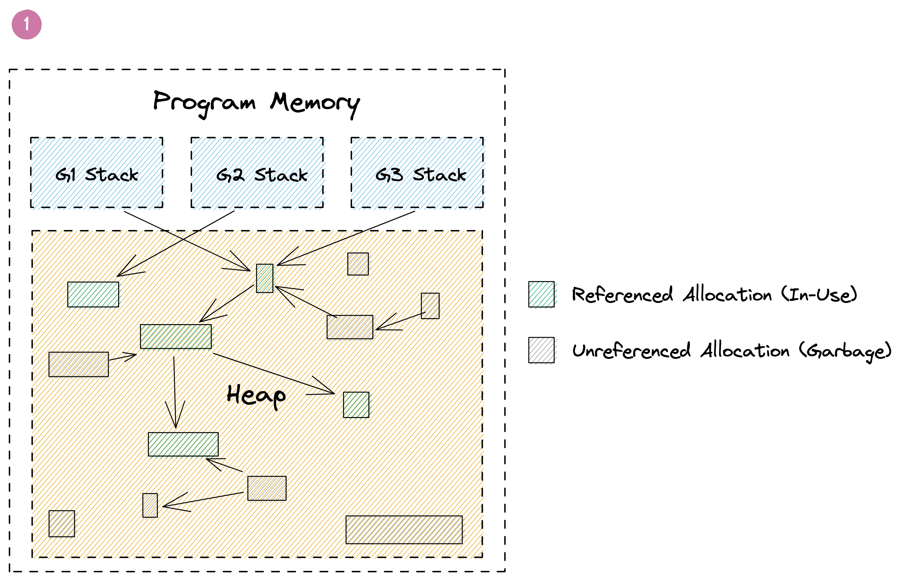

⬅ [Index of all go-profiler-notes](../README.md)
# The Busy Developers's Guide to Go Profiling, Tracing and Observability

- **[Introduction](#introduction):** [Read This](#read-this) · [Mental Model for Go](#mental-model-for-go) · Profiling vs Tracing
- **Use Cases:** Reduce Costs · Reduce Latency · Memory Leaks · Program Hanging · Outages
- **Go Profilers**: [CPU](#cpu-profiler) · Memory · Block · Mutex · Goroutine · [ThreadCreate](#threadcreate)
- **Viewing Profiles**: Command Line · Flame Graph · Graph
- **Go Execution Tracer:** Timeline View · Derive Profiles
- **Go Metrics:**  MemStats
- **Other Tools:** time · perf · bpftrace
- **Advanced Topics:** Assembly · Stack Traces · Little's Law
- **Datadog Products:** Continuous Profiler · APM (Distributed Tracing) · Metrics

🚧 This document is a work in progress. All sections above will become clickable links over time. The best way to find out about updates is to follow me and [my thread on twitter](https://twitter.com/felixge/status/1435537024388304900) where I'll announce new sections being added.

# Introduction

## Read This

This is a practical guide aimed at busy gophers interested in improving their programs using profiling and tracing. If you're not well versed in the internals of Go, it is recommended that you read the entire introduction first. After that you should feel free to jump to any section you are interested in.
## Mental Model for Go

It is possible to become quite proficient in writing Go code without understanding how the language works under the hood. But when it comes to performance and debugging, you'll hugely benefit from having a mental model of the internals. Therefore we'll begin with laying out a rudimentary model of Go below. This model should be good enough to allow you to avoid the most common mistakes, but [all models are wrong](https://en.wikipedia.org/wiki/All_models_are_wrong), so you are encouraged to seek out more in-depth material to tackle harder problems in the future.

Go's primary job is to multiplex and abstract hardware resources, similar to an operating system. This is generally accomplished using two major abstractions:

1. **Goroutine Scheduler:** Manages how your code is being executed on the CPUs of your system.
2. **Garbage Collector:** Provides virtual memory that is automatically freed as needed.


### Goroutine Scheduler

Let's talk about the scheduler first using the example below:

```go
func main() {
    res, err := http.Get("https://example.org/")
    if err != nil {
        panic(err)
    }
    fmt.Printf("%d\n", res.StatusCode)
}
```

Here we have a single goroutine, let's call it `G1`, that runs the `main` function. The picture below shows a simplified timeline of how this goroutine might execute on a single CPU. Initially `G1` is running on the CPU to prepare the http request. Then the CPU becomes idle as the goroutine has to wait for the network. And finally it gets scheduled onto the CPU again to print out the status code.


From the scheduler's perspective, the program above executes like shown below. At first `G1` is `Executing` on `CPU 1`. Then the goroutine is taken off the CPU while `Waiting` for the network. Once the scheduler notices that the network has replied (using non-blocking I/O, similar to to Node.js), it marks the goroutine as `Runnable`. And as soon as a CPU core becomes available, the goroutine starts `Executing` again. In our case all cores are available, so `G1` can go back to `Executing` the `fmt.Printf()` function on one of the CPUs immediately without spending any time in the `Runnable` state.


Most of the time, Go programs are running multiple goroutines, so you will have a few goroutines `Executing` on some of the CPU cores, a large number of goroutines `Waiting` for various reasons, and ideally no goroutines `Runnable` unless your program exhibits very high CPU load. An example of this can be seen below.


Of course the model above glosses over many details. In reality it's turtles all the way down, and the Go scheduler works on top of threads managed by the operating system, and even CPUs themselves are capable of hyper-threading which can be seen as a form of scheduling. So if you're interested, feel free to continue down this rabbit hole via Ardan labs series on [Scheduling in Go](https://www.ardanlabs.com/blog/2018/08/scheduling-in-go-part1.html) or similar material.

However, the model above should be sufficient to understand the remainder of this guide. In particular it should become clear that the time measured by the various Go profilers is essentially the time your goroutines are spending in the `Executing` and `Waiting` states as illustrated by the diagram below.


### Garbage Collector

The other major abstraction in Go is the garbage collector. In languages like C, the programmer needs to manually deal with allocating and releasing memory using `malloc()` and `free()`. This offers great control, but turns out to be very error prone in practice. A garbage collector can reduce this burden, but the automatic management of memory can easily become a performance bottleneck. This section of the guide will present a simple model for Go's GC that should be useful for identifying and optimizing memory management related problems.

#### The Stack

Let's start with the basics. Go can allocate memory in one of two places, the stack or the heap. Each goroutine has its own stack which is a contiguous area of memory. Additionally there is a big area of memory shared between goroutines that is called the heap. This can be seen in the picture below.


When a function calls another function it gets its own section on the stack called a stack frame where it can place things like local variables. A stack pointer is used to identify the next free spot in the frame. When a function returns, the data from the last frame is discarded by simply moving the stack pointer back to end of the previous frame. The frame's data itself can linger on the stack, and gets overwritten by the next function call. This is very simple and efficient as Go doesn't have to keep track of each variable.

To make this a little more intuitive, let's look at the example below:

```go
func main() {
	sum := 0
	sum = add(23, 42)
	fmt.Println(sum)
}

func add(a, b int) int {
	return a + b
}
```

Here we have a `main()` function that starts out by reserving some space on the stack for the variable `sum`. When the `add()` function gets called, it gets its own frame to hold the local `a` and `b` parameters. Once the `add()` returns, its data is discarded by moving the stack pointer back to the end of the `main()` function's frame, and the `sum` variable gets updated with the result. Meanwhile the old values of `add()` linger beyond the stack pointer to be overwritten by the next function call. Below is a visualization of this process:


The example above is highly simplified and omits many details around return values, frame pointers, return addresses and function inlining. In fact, as of Go 1.17, the program above may not even need any space on the stack as the small amount of data can be managed using CPU registers by the compiler. But that's okay. This model should still give you a reasonable intuition for the way non-trivial Go programs allocate and discard local variables on the stack.

One thing you might wonder at this point is what happens if you run out of space on the stack. In languages like C this would cause a stack overflow error. Go on the other hand automatically deals with this problem by making a copy of the stack that's twice as big. This allows goroutines to start out with very small, typically 2 KiB stacks, and is one of the key ingredients for [making goroutines more scalable](https://golang.org/doc/faq#goroutines) than operating system threads.

Another aspect of the stack is how it's involved in creating stack traces. This is a bit more advanced, but if you're interested check out the [Stack Traces in Go](../stack-traces.md) document in this repo.
#### The Heap

Stack allocations are great, but there are many situations where Go can't utilize them. The most common one is returning a pointer to a local variable of a function. This can be seen in this modified version of our `add()` example from above:

```go
func main() {
	fmt.Println(*add(23, 42))
}

func add(a, b int) *int {
	sum := a + b
	return &sum
}
```

Normally Go would be able to allocate the `sum` variable inside of the `add()` function on the stack. But as we've learned, this data gets discarded when the `add()` function returns. So in order to safely return a `&sum` pointer, Go has to allocate the memory for it from outside of the stack. And that's where the heap comes in.

The heap is used for storing memory that might outlive the function that creates it, as well as for any data that is shared between goroutines using pointers. However, this raises the question of how this memory gets freed. Because unlike stack allocations, heap allocations can't be discarded when the function that created them returns.

Go solves this problem using its built-in garbage collector. The details of its implementation are very complex, but from a birds eye view, it keeps track of your memory as shown in the picture below. Here you can see three goroutines that have pointers to green allocations on the heap. Some of these allocations also have pointers to other allocations shown in green. Additionally there are grey allocations that may point to the green allocations or each other, but they are not referenced by a green allocation themselves. Those allocations were once reachable, but are now considered to be garbage. This can happen if the function that allocated their pointers on the stack returned, or their value was overwritten. The GC is responsible for automatically identifying and freeing those allocations.



Performing GC involves a lot of expensive graph traversal and cache thrashing. It even requires regular stop-the-world phases that halt the execution of your entire program. Luckily recent versions of Go have gotten this down to fractions of a millisecond, but much of the remaining overhead is inherent to any GC. In fact, it's not uncommon that 20-30% of a Go program's execution are spend on memory management.

Generally speaking the costs of GC is proportional to the amount of heap allocations your program performs. So when it comes to optimizing the memory related overhead of your program, the mantra is:

- **Reduce**: Try to to turn heap allocations into stack allocations or avoid them alltogether.
- **Reuse:** Reuse heap allocations rather than replacing them with new ones.
- **Recycle:** Some heap allocations can't be avoided. Let the GC recycle them and focus on other issues.

As with the previous mental model in this guide, everything above is an extremely simplified view of reality. But hopefully it will be good enough to make sense out of the remainder of this guide, and inspire you to read more articles on the subject. One article you should definitely read is [Getting to Go: The Journey of Go's Garbage Collector](https://go.dev/blog/ismmkeynote) which gives you a good idea of how Go's GC has advanced over the years, and the pace at which it is improving.

# Go Profilers
## CPU Profiler

Go's CPU profiler can help you identify which parts of your code base consume a lot of CPU time.

⚠️ Please note that CPU time is usually different from the real time experienced as latency by your users. For example a typical http request might take `100ms` to complete, but only consume `5ms` of CPU time while waiting for `95ms` on a database. It's also possible for a request to take `100ms`, but spend `200ms` of CPU if two goroutines are performing CPU intensive work in parallel. If this is confusing to you, please refer to the [Mental Model for Go section](#mental-model-for-go).

You can enable the CPU profiler via various APIs:

- `go test -cpuprofile cpu.pprof` will run your tests and write a CPU profile to a file named `cpu.pprof`.
- [`pprof.StartCPUProfile(w)`](https://pkg.go.dev/runtime/pprof#StartCPUProfile) will capture a CPU profile to `w` that covers the time span until [`pprof.StopCPUProfile()`](https://pkg.go.dev/runtime/pprof#StopCPUProfile) is called.
- [`import _ "net/http/pprof"`](https://pkg.go.dev/net/http/pprof) allows you to request a 30s CPU profile by hitting the `GET /debug/pprof/profile?seconds=30` of the default http server that you can start via `http.ListenAndServe("localhost:6060", nil)`.

Regardless of how you activate the CPU profiler, the resulting profile will be a frequency table of stack traces formatted in the binary [pprof](../pprof.md) format. A simplified version of such a table is shown below:

|stack trace|samples/count|cpu/nanoseconds|
|-|-|-|
|main;foo|5|50000000|
|main;foo;bar|3|30000000|
|main;foobar|4|40000000|

The CPU profiler captures this data by asking the operating system to monitor the CPU usage of the application and sends it a `SIGPROF` signal for every `10ms` of CPU time it consumes. The OS also includes time consumed by the kernel on behalf of the application in this monitoring. Since the signal deliver rate depends on CPU consumption, it's dynamic and can be up to `N * 100Hz` where `N` is the number of logical CPU cores on the system. When a `SIGPROF` signal arrives, Go's signal handler captures a stack trace of the currently active goroutine, and increments the corresponding values in the profile. The `cpu/nanoseconds` value is currently directly derived from the sample count, so it is redundant, but convenient.

### Profiler Labels

A cool feature of Go's CPU profiler is that you can attach arbitrary key value pairs to a goroutine. These labels will be inherited by any goroutine spawned from that goroutine and show up in the resulting profile.

Let's consider the [example](./cpu-profiler-labels.go) below that does some CPU `work()` on behalf of a `user`. By using the [`pprof.Labels()`](https://pkg.go.dev/runtime/pprof#Labels) and [`pprof.Do()`](https://pkg.go.dev/runtime/pprof#Do) API, we can associate the `user` with the goroutine that is executing the `work()` function. Additionally the labels are automatically inherited by any goroutine spawned within the same code block, for example the `backgroundWork()` goroutine.

```go
func work(ctx context.Context, user string) {
	labels := pprof.Labels("user", user)
	pprof.Do(ctx, labels, func(_ context.Context) {
		go backgroundWork()
		directWork()
	})
}
```

The resulting profile will include a new label column and might look something like this:

|stack trace|label|samples/count|cpu/nanoseconds|
|-|-|-|-|
|main.childWork|user:bob|5|50000000|
|main.childWork|user:alice|2|20000000|
|main.work;main.directWork|user:bob|4|40000000|
|main.work;main.directWork|user:alice|3|30000000|

Viewing the same profile with pprof's Graph view will also include the labels:


How you use these labels is up to you. You might include things such as `user ids`, `request ids`, `http endpoints`, `subscription plan` or other data that can allow you to get a better understanding of what types of requests are causing high CPU utilization, even when they are being processed by the same code paths. That being said, using labels will increase the size of your pprof files. So you should probably start with low cardinality labels such as endpoints before moving on to high cardinality labels once you feel confident that they don't impact the performance of your application.

### CPU Utilization

Since the sample rate of the CPU profiler adapts to amount of CPU your program is consuming, you can derive the CPU utilization from CPU profiles. In fact pprof will do this automatically for you. For example the profile below was taking from a program that had an average CPU utilization of `147.77%`:

```
$ go tool pprof guide/cpu-utilization.pprof
Type: cpu
Time: Sep 9, 2021 at 11:34pm (CEST)
Duration: 1.12s, Total samples = 1.65s (147.77%)
Entering interactive mode (type "help" for commands, "o" for options)
(pprof) 
```

Another popular way to express CPU utilization is CPU cores. In the example above the program was using an average of `1.47` CPU cores during the profiling period.

⚠️ Due to one of the known issues below you shouldn't put too much trust in this number if it's near or higher than `250%`. However, if you see a very low number such as `10%` this usually indicates that CPU consumption is not an issue for your application. A common mistake is to ignore this number and start worrying about a particular function taking up a long time relative to the rest of the profile. This is usually a waste of time when overall CPU utilization is low, as not much can be gained from optimizing this function.
### Known CPU Profiler Issues

There are a few known issues and limitations of the CPU profiler that you might want to be aware of:

- 🐞 A known issue on linux is that the CPU profiler struggles to achieve a sample rate beyond `250Hz`. This is usually not a problem, but can lead to bias if your CPU utilization is very spiky. For more information on this, check out this [GitHub issue](https://github.com/golang/go/issues/35057).
- ⚠️️ You can call [`runtime.SetCPUProfileRate()`](https://pkg.go.dev/runtime#SetCPUProfileRate) to adjust the CPU profiler rate before calling `runtime.StartCPUProfile()`. This will print a warning saying `runtime: cannot set cpu profile rate until previous profile has finished`. However, it still works within the limitation of the bug mentioned above. This issue was [initially raised here](https://github.com/golang/go/issues/40094), and there is an [accepted proposal for improving the API](https://github.com/golang/go/issues/42502).
- ⚠️ The maximum number of nested function calls that can be captured in stack traces by the CPU profiler is currently [hard coded to `64`](https://sourcegraph.com/search?q=context:global+repo:github.com/golang/go+file:src/*+maxCPUProfStack+%3D&patternType=literal). If your program is using a lot of recursion or other patterns that lead to deep stack depths, your CPU profile will include stack traces that are truncated. This means you will miss parts of the call chain that led to the function that was active at the time the sample was taken.

## ThreadCreate

🐞 The threadcreate profile is intended to show stack traces that led to the creation of new OS threads. However, it's been [broken since 2013](https://github.com/golang/go/issues/6104), so you should stay away from it.

# Disclaimers

I'm [felixge](https://github.com/felixge) and work at [Datadog](https://www.datadoghq.com/) on [Continuous Profiling](https://www.datadoghq.com/product/code-profiling/) for Go. You should check it out. We're also [hiring](https://www.datadoghq.com/jobs-engineering/#all&all_locations) : ).

The information on this page is believed to be correct, but no warranty is provided. Feedback is welcome!

<!--
Notes:

- Heap: Maybe a good article to link: https://medium.com/@ankur_anand/a-visual-guide-to-golang-memory-allocator-from-ground-up-e132258453ed
- GC Cost: O(N) with regards to live allocations on the heap containing pointers.
- Each pointer slot in an allocation has a cost! Even nil pointers.
- Reducing Costs: Talk about CPU, Memory and Networking. Is it possible to profile the latter?
- pprof: Maybe host a service to convert perf.data files into pprof files?
- Reuse cute gophers from conf talks.

-->