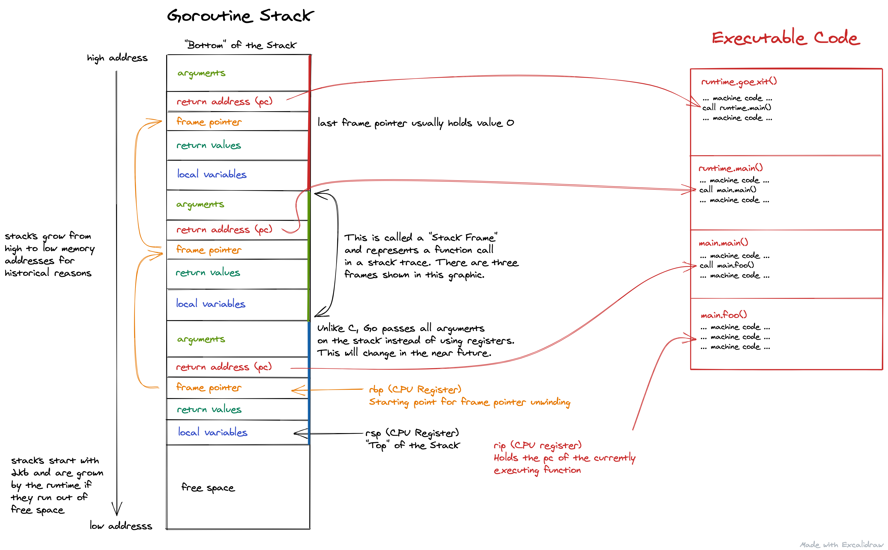

# Stack Traces in Go

Stack traces play a critical role in Go profiling. So let's try to understand them to see how they might impact the overhead and accuracy of your profiles. 

## Introduction

All Go profilers work by collecting samples of stack trace  and putting them into [pprof profiles](./pprof.md). Ignoring some details, a pprof profile is just a frequency table of stack traces like shown below:

| stack trace  | samples/count |
| ------------ | ------------- |
| main;foo     | 5             |
| main;foo;bar | 3             |
| main;foobar  | 4             |

Let's zoom in on the second stack trace in the table above: `main;foo;bar`. A Go developer will usually be more familiar with seeing a stack trace like this as rendered by `panic()` or  [`runtime.Stack()`](https://golang.org/pkg/runtime/#Stack) shown below:

```
goroutine 1 [running]:
main.bar(...)
	/path/to/go-profiler-notes/examples/stack-trace/main.go:17
main.foo(...)
	/path/to/go-profiler-notes/examples/stack-trace/main.go:9
main.main()
	/path/to/go-profiler-notes/examples/stack-trace/main.go:5 +0x3a
```

This text format has been [described elsewhere](https://www.ardanlabs.com/blog/2015/01/stack-traces-in-go.html) so we won't discuss the details of it here. Instead we'll dive even deeper and ask ourselves where this data is coming from.

## Goroutine Stack

Stack traces 



## Stack Unwinding

### Frame Pointers

To write ...

### .gopclntab

To write ...

### DWARF

To write ...

## Symbolization

Woho

## Overhead

To write ...


## Accuracy

To write ...