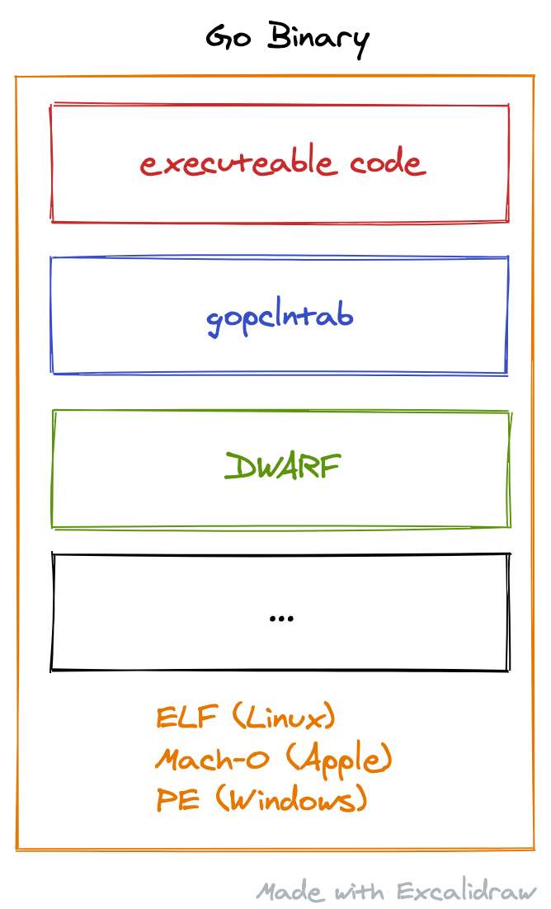

⬅ [Index of all go-profiler-notes](./README.md)

[Introduction](#intrudction) - [Goroutine Stack](#goroutine-stack) ([Stack Layout](#stack-layout), [Real Example](#real-example), [cgo](#cgo)) - [Unwinding](#unwinding) ([Frame Pointer](#frame-pointer), [gopclntab](#gopclntab), [DWARF](#dwarf)) - [Symbolization](#symbolization)

This document was last updated for `go1.16` but probably still applies to older/newer versions for the most parts.

# Stack Traces in Go

Stack traces play a critical role in Go profiling. So let's try to understand them to see how they might impact the overhead and accuracy of our profiles. 

## Introduction

All Go profilers work by collecting samples of stack traces and putting them into [pprof profiles](./pprof.md). Ignoring some details, a pprof profile is just a frequency table of stack traces like shown below:

| stack trace  | count |
| ------------ | ----- |
| main;foo     | 5     |
| main;foo;bar | 3     |
| main;foobar  | 4     |

Let's zoom in on the first stack trace in the table above: `main;foo`. A Go developer will usually be more familiar with seeing a stack trace like this as rendered by `panic()` or  [`runtime.Stack()`](https://golang.org/pkg/runtime/#Stack) as shown below:

```
goroutine 1 [running]:
main.foo(...)
	/path/to/go-profiler-notes/examples/stack-trace/main.go:9
main.main()
	/path/to/go-profiler-notes/examples/stack-trace/main.go:5 +0x3a
```

This text format has been [described elsewhere](https://www.ardanlabs.com/blog/2015/01/stack-traces-in-go.html) so we won't discuss the details of it here. Instead we'll dive deeper into the source of this data.

## Goroutine Stack

As the name implies, stack traces originate from "the stack". Even so the details vary, most programming languages have a concept of a stack and use it to store things like local variables, arguments, return values and return addresses. Generating a stack trace usually involves navigating the stack in a process known as [Unwinding](#unwinding) that will be described in more detail later on.

Platforms like `x86-64` define a [stack layout](https://eli.thegreenplace.net/2011/09/06/stack-frame-layout-on-x86-64) and [calling convention](https://github.com/hjl-tools/x86-psABI/wiki/x86-64-psABI-1.0.pdf) for C and encourage other programming languages to adopt it for interoperability. Go doesn't follow these conventions, and instead uses its own idiosyncratic [calling convention](https://dr-knz.net/go-calling-convention-x86-64.html). Future versions of Go (1.17?) will adopt a more traditional [register-based](https://go.googlesource.com/proposal/+/refs/changes/78/248178/1/design/40724-register-calling.md) convention that will improve performance. However even the new convention won't be platform-compatible as that would negatively impact goroutine scalability.

Go's stack layout is slightly different on different platforms. To keep things manageable, we'll assume that we're on `x86-64` for the remainder of this document.

### Stack Layout

Now let's take a closer look at the stack. Every goroutine has its own stack that is at least [2 KiB](https://sourcegraph.com/search?q=repo:golang/go+repo:%5Egithub%5C.com/golang/go%24+_StackMin+%3D&patternType=literal) and grows from a high memory address towards lower memory addresses. This can be a bit confusing and is mostly a historical convention from a time when the address space was so limited that one had to worry about the stack colliding with other memory regions used by the program.

The picture below shows the stack of a sample goroutine that is currently calling `main.foo()` like our example above:


There is a lot going on in this picture, but for now let's focus on the things highlighted in red. To get a stack trace, the first thing we need is the current program counter (`pc`). This is found in a CPU register called `rip` (instruction pointer register) and points to another region of memory that holds the executable machine code of our program. Since we're currently calling `main.foo()`  `rip` is pointing to an instruction within that function. If you're not familiar with registers, you can think of them as special CPU variables that are incredibly fast to access. Some of them, like `rip`, `rsp` or `rbp` have special purposes, while others can be used by compilers as they see fit.

Now that we know the program counter of the current function, it's time to find `pc` values of our callers, i.e. all the `return address (pc)` values that are also highlighted in red. There are various techniques for doing this, which are described in the [Unwinding](#unwinding) section. The end result is a list of program counters that represent a stack trace just like the one you can get from [`runtime.Callers()`](https://golang.org/pkg/runtime/#Callers). Last but not least, these `pc` values are usually translated into human readable file/line/function names as described in the [Symbolization](#symbolization) section below. In Go itself you can simply calll [`runtime.CallerFramers()`](https://golang.org/pkg/runtime/#CallersFrames) to symbolize a list of `pc` values.

### Real Example

Looking at pretty pictures can be a good way to get a high level understanding of the stack, but it has its limits. Sometimes you need to look at the raw bits & bytes in order to get a full understanding. If you're not interested in that, feel free to skip ahead to the next section.

To take a look at the stack, we'll use [delve](https://github.com/go-delve/delve) which is a wonderful debugger for Go. In order to inspect the stack, I wrote a script called [stackannotate.star](./delve/stackannotate.star) that can used to print the annotated stack for a simple [example program](./examples/stackannotate/main.go):

```
$ dlv debug ./examples/stackannotate/main.go 
Type 'help' for list of commands.
(dlv) source delve/stackannotate.star
(dlv) continue examples/stackannotate/main.go:19
Breakpoint 1 set at 0x1067d94 for main.bar() ./examples/stackannotate/main.go:19
> main.bar() ./examples/stackannotate/main.go:19 (hits goroutine(1):1 total:1) (PC: 0x1067d94)
    14:	}
    15:	
    16:	func bar(a int, b int) int {
    17:		s := 3
    18:		for i := 0; i < 100; i++ {
=>  19:			s += a * b
    20:		}
    21:		return s
    22:	}
(dlv) stackannotate
regs    addr        offset  value               explanation                     
        c00004c7e8       0                   0  ?                               
        c00004c7e0      -8                   0  ?                               
        c00004c7e8     -16                   0  ?                               
        c00004c7e0     -24                   0  ?                               
        c00004c7d8     -32             1064ac1  return addr to runtime.goexit   
        c00004c7d0     -40                   0  frame pointer for runtime.main  
        c00004c7c8     -48             1082a28  ?                               
        c00004c7c0     -56          c00004c7ae  ?                               
        c00004c7b8     -64          c000000180  var g *runtime.g                
        c00004c7b0     -72                   0  ?                               
        c00004c7a8     -80     100000000000000  var needUnlock bool             
        c00004c7a0     -88                   0  ?                               
        c00004c798     -96          c00001c060  ?                               
        c00004c790    -104                   0  ?                               
        c00004c788    -112          c00001c060  ?                               
        c00004c780    -120             1035683  return addr to runtime.main     
        c00004c778    -128          c00004c7d0  frame pointer for main.main     
        c00004c770    -136          c00001c0b8  ?                               
        c00004c768    -144                   0  var i int                       
        c00004c760    -152                   0  var n int                       
        c00004c758    -160                   0  arg ~r1 int                     
        c00004c750    -168                   1  arg a int                       
        c00004c748    -176             1067c8c  return addr to main.main        
        c00004c740    -184          c00004c778  frame pointer for main.foo      
        c00004c738    -192          c00004c778  ?                               
        c00004c730    -200                   0  arg ~r2 int                     
        c00004c728    -208                   2  arg b int                       
        c00004c720    -216                   1  arg a int                       
        c00004c718    -224             1067d3d  return addr to main.foo         
bp -->  c00004c710    -232          c00004c740  frame pointer for main.bar      
        c00004c708    -240                   0  var i int                       
sp -->  c00004c700    -248                   3  var s int
```

The script isn't perfect and there are some addresses on the stack that it's unable to automatically annotate for now (contributions welcome!). But generally speaking, you should be able to use it to check your understanding against the abstract stack drawing that was presented earlier.

If you want to try it out yourself, perhaps modify the example program to spawn `main.foo()` as a goroutine and observe how that impacts the stack.

### cgo

Go's stack implementation described above is making an important tradeoff when it comes to interacting with code written in languages that follow platform calling conventions such as C. Instead of being able to call such functions directly, Go has to perform [complicated rituals](https://golang.org/src/runtime/cgocall.go) for switching between goroutine stacks and OS-allocated stacks that can run C code. This comes with a certain amount of performance overhead and also poses complex issues for capturing stack traces during profiling, see [runtime.SetCgoTraceback()](https://golang.org/pkg/runtime/#SetCgoTraceback).

🚧 I'll try to describe this in more detail in the future.

## Unwinding

Unwinding (or stack walking) is the process of collecting all the return addresses (see red elements in [Stack Layout](#stack-layout)) from the stack. Together with the current instruction pointer register (`rip`) they form a list of program counter (`pc`) values that can be turned into a human readable stack trace via [Symbolization](#symbolization).

The Go runtime, including the builtin profilers, exclusively use  [gopclntab](#gopclntab) for unwinding. However, we'll start with describing [Frame Pointer](#frame-pointer) unwinding first, because it is much easier to understand and might [become supported in the future](https://github.com/golang/go/issues/16638). After that we'll also discuss [DWARF](#dwarf) which is yet another way to unwind Go stacks.

For those not familiar with it, below is a simple diagram showing the relevant sections of a typical Go binary file that we'll be discussing here. They are always wrapped inside either the ELF, Mach-O or PE container format, depending on the operating system.



### Frame Pointer

Frame pointer unwinding is the simple process of following the base pointer register (`rbp`) to the first frame pointer on the stack which points to the next frame pointer and so on. In other words, it is following the orange lines in the [Stack Layout](#stack-layout) graphic. For each visited frame pointer, the return address (pc) sitting 8 bytes above the frame pointer is collected along the way. That's it : ).

The main downside to frame pointers is that pushing them onto the stack adds some performance overhead to every function call during normal program execution. The Go authors estimated an average 2% execution overhead for an average program in the [Go 1.7 release notes](https://golang.org/doc/go1.7). Another data point is the Linux kernel where overheads of [5 - 10% were observed](https://lore.kernel.org/lkml/20170602104048.jkkzssljsompjdwy@suse.de/T/#u) for e.g. sqlite and pgbench. Because of this compilers such as `gcc` offer options such as `-fomit-frame-pointers` to omit them for better performance. However, it's a devil's bargain: It gives you small performance win right away, but it reduces your ability to debug and diagnose performance issues in the future. Because of this the general advice is:

> Always compile with frame pointers. Omitting frame pointers is an evil compiler optimization that breaks debuggers, and sadly, is often the default.
> – [Brendan Gregg](http://www.brendangregg.com/perf.html)

In Go you don't even need this advice. Since Go 1.7 frame pointers are enabled by default for 64 bit binaries, and there is no `-fomit-frame-pointers` footgun available. This allows Go to be compatible with third party debuggers and profilers such as [Linux perf](http://www.brendangregg.com/perf.html) out of the box.

If you'd like to see a simple frame pointer unwinding implementation, you can check out [this toy project](https://github.com/felixge/gounwind) which has a light-weight alternative to `runtime.Callers()`. The simplicity should speak for itself when compared to the other unwinding methods described below. It should also be clear that frame pointer unwinding has `O(N)` time complexity where `N` is the number of stack frames that need to be traversed.

Despite the apparent simplicity, frame pointer unwinding is no panacea. Frame pointers are pushed to the stack by the callee, so for interrupt based profiling there is an inherent race condition that might cause you to miss the caller of the current function in your stack trace. Additionally frame pointer unwinding alone can't identify inlined function calls. So at least some of the complexity of [gopclntab](#gopclntab) or [DWARF](#dwarf) is essential to enable accurate unwinding.

### gopclntab

Despite frame pointers being available on 64bit platforms, Go is not leveraging them for unwinding ([this might change](https://github.com/golang/go/issues/16638)). Instead Go ships with its own idiosyncratic unwinding tables that are embedded in the `gopclntab` section of any Go binary. `gopclntab` stands for "go program counter line table", but this is a bit of a misnomer as it contains various tables and meta data required for unwinding and symbolization.

As far as unwinding is concerned, the general idea is to embed a "virtual frame pointer table" (called `pctab`) inside of `gopclntab` that maps program counters (`pc`) to the distance (aka `sp delta`) between the stack pointer (`rsp`) and the `return address (pc)` above it. The initial lookup in this table uses the `pc` from the `rip` instruction pointer register and then uses the `return address (pc)` for the next lookup and so on. This way you can always unwind regardless of whether or not you have physical frame pointers on the stack.

Russ Cox initially described some of the involved data structures in his [Go 1.2 Runtime Symbol Information](https://golang.org/s/go12symtab) document, but it's very outdated by now and it's probably better to look at the current implementation directly. The relevant files are [runtime/traceback.go](https://github.com/golang/go/blob/go1.16.3/src/runtime/traceback.go) and [runtime/symtab.go](https://github.com/golang/go/blob/go1.16.3/src/runtime/symtab.go), so let's dive in.

The core of Go's stack trace implementation is in the [`gentraceback()`](https://github.com/golang/go/blob/go1.16.3/src/runtime/traceback.go#L76-L86) function which is being called from various places. If the caller is e.g. `runtime.Callers()` the function only needs to do unwinding, but e.g. `panic()` wants text output, which requires symbolization as well. Additionally the code has to deal with the difference between [link register architectures](https://en.wikipedia.org/wiki/Link_register) such as ARM that work a little different from x86. This combination of unwinding, symbolization, support for different architectures and bespoke data structures might just be a regular day in the shop for the system developers on the Go team, but it's definitely been tricky for me, so please watch out for potential inaccuracies in my description below.

Each frame lookup begins with the current `pc` which is passed to [`findfunc()`](https://github.com/golang/go/blob/go1.16.3/src/runtime/symtab.go#L671) which looks up the meta data for the function that contains the `pc`. Historically this was done using `O(log N)` binary search, but [nowadays](https://go-review.googlesource.com/c/go/+/2097/) there is a hash-map-like index of [`findfuncbucket`](https://github.com/golang/go/blob/go1.16.3/src/runtime/symtab.go#L671) structs that usually directly guides us to the right entry using an `O(1)` algorithm.

The [_func](https://github.com/golang/go/blob/9baddd3f21230c55f0ad2a10f5f20579dcf0a0bb/src/runtime/runtime2.go#L825) meta data that we just retrieved contains a `pcsp` offset into the `pctab` table that maps program counters to stack pointer deltas. To decode this information, we call [`funcspdelta()`](https://github.com/golang/go/blob/go1.16.3/src/runtime/symtab.go#L903) which does a linear search over all program counters that change the `sp delta` of the function until it finds the closest (`pc`, `sp delta`) pair. For stacks with recursive call cycles, a tiny program counter cache is used to avoid doing lots of duplicated work.

Now that we have the stack pointer delta, we are almost ready to locate the next `return address (pc)` value of the caller and do the same lookup for it until we reach the "bottom" of the stack. But before that, we need to check if the current `pc` is part of one or more inlined function calls. This is done by checking the `_FUNCDATA_InlTree` data for the current `_func` and doing another linear search over the (`pc`, `inline index`) pairs in that table. Any inlined call found this way gets a virtual stack frame `pc` added to the list. Then we continue with `return address (pc)` as mentioned in the beginning of the paragraph.

Putting it all together, under reasonable assumptions, the effective time complexity of `gocplntab` unwinding is the same as frame pointer unwinding, i.e. `O(N)` where `N` is the number of frames on the stack, but with higher constant overheads. This can be validated [experimentally](https://github.com/DataDog/go-profiler-notes/tree/main/examples/stack-unwind-overhead), but for most applications a good rule of thumb is to assume a cost of `~1µs`  to unwind a stack trace. So if you're aiming for < 1% CPU profiling overhead in production, you should try to configure your profilers to not track more than ~10k events per second per core. That's a decent amount of data, but for some tools like the [built-in tracer](https://golang.org/pkg/runtime/trace/) stack unwinding can be a significant bottleneck. In the future this could be overcome by the Go core adding [support for frame pointer unwinding](https://github.com/golang/go/issues/16638) which might be up to [50x faster](https://github.com/felixge/gounwind) than the current `gopclntab` implementation.

Last but not least, it's worth noting that Go ships with two `.gopclntab` implementations. In addition to the one I've just described, there is another one in the [debug/gosym](https://golang.org/pkg/debug/gosym/) package that seems to be used by the linker, `go tool addr2line` and others. If you want, you can use it yourself in combination with [debug/elf](./examples/pclnttab/linux.go) or ([debug/macho](./examples/pclnttab/darwin.go)) as a starting point for your own [gopclntab adventures](./examples/pclnttab) for good or [evil](https://tuanlinh.gitbook.io/ctf/golang-function-name-obfuscation-how-to-fool-analysis-tools).

### DWARF

[DWARF](https://en.wikipedia.org/wiki/DWARF) is a standardized debugging format that is understood by many debuggers (e.g. [delve](https://github.com/go-delve/delve)) and profilers (e.g. Linux [perf](http://www.brendangregg.com/perf.html)). It enables a superset of features found in `gopclntab`, including unwinding and symbolization, but has a reputation for being very complex. The Linux kernel has famously refused to adopt DWARF unwinding for kernel stack traces:

> The whole (and *only*) point of unwinders is to make debugging easy when a bug occurs [...]. An unwinder that is several hundred lines long is simply not even *remotely* interesting to me.
> – [Linus Torvalds](https://lkml.org/lkml/2012/2/10/356)

This lead to the [creation](https://lwn.net/Articles/728339/) of the [ORC unwinder](https://www.kernel.org/doc/html/latest/x86/orc-unwinder.html) which is now available in the kernel as yet another unwinding mechanism. However, ORCs play no role for Go stack traces, we only have to fight with ELFs and DWARFs here.

The Go compiler always emits DWARF (v4) information for the binaries it produces. The format is standardized, so unlike `gopclntab`, external tools can rely on it. However, the DWARF data is also largely redundant with `gopclntab` and negatively impacts build times and binary sizes. Because of this Rob Pike is proposing to [disable it by default](https://github.com/golang/go/issues/26074), but it's still under discussion.

Unlike `gopclntab`, DWARF information can easily be stripped from binaries at build time like this:

```
go build -ldflags=-w <pkg>
```

Just like `-fomit-frame-pointers` this is a bit of a devil's bargain, but some people don't believe in the distinction between DWARF and the devil. So if you're willing to sign a waiver of liability to your colleagues, you may proceed. Seriously so, I'd advise you to only strip DWARF symbols if it solves an important problem for you. Once DWARF information has been stripped, you won't be able to use perf, delve or other tools to profile or debug your applications in production.

As far as the inner workings of DWARF are concerned, the [official spec](http://dwarfstd.org/) has 460 pages of wisdom on the matter. For our purposes it's probably sufficient to say that DWARF is a superset of [gopclntab](#gopclntab) and works very similar. I.e. you've got tables mapping `pc` addresses to stack pointer deltas which allow you to unwind the stack without the need for frame pointers.

## Symbolization

Symbolization is the process of taking one or more program counter (`pc`) address and turning them into human readable symbols such a function names, file names and line numbers. For example if you have two `pc` values like this:

```
0x1064ac1
0x1035683
```

You may use symbolization to turn them into a human readable stack trace like shown below:

```
main.foo()
	/path/to/go-profiler-notes/examples/stack-trace/main.go:9
main.main()
	/path/to/go-profiler-notes/examples/stack-trace/main.go:5
```

In the Go runtime, symbolization always uses the symbol information contained in the [gopclntab](#gopclntab) section. This information can also be access via  [`runtime.CallerFramers()`](https://golang.org/pkg/runtime/#CallersFrames).

3rd party profilers such a Linux perf can't use [gopclntab](#gopclntab) and have to rely on [DWARF](#dwarf) for symbolization instead.

## History

In order to support 3rd profilers such as [perf](http://www.brendangregg.com/perf.html) the  [Go 1.7](https://golang.org/doc/go1.7) (2016-08-15) release started to enable frame pointers by default for [64bit binaries](https://sourcegraph.com/search?q=framepointer_enabled+repo:%5Egithub%5C.com/golang/go%24+&patternType=literal).

## Credits

A big thanks goes to [Michael Pratt](https://github.com/prattmic) for [reviewing](https://github.com/DataDog/go-profiler-notes/commit/6a62d5908079ddac9c92d319f49fde846f329c55#r49179154) parts of the `gopclntab` section in this document and catching some significant errors in my analysis.

## Disclaimers

I'm [felixge](https://github.com/felixge) and work at [Datadog](https://www.datadoghq.com/) on [Continuous Profiling](https://www.datadoghq.com/product/code-profiling/) for Go. You should check it out. We're also [hiring](https://www.datadoghq.com/jobs-engineering/#all&all_locations) : ).

The information on this page is believed to be correct, but no warranty is provided. Feedback is welcome!